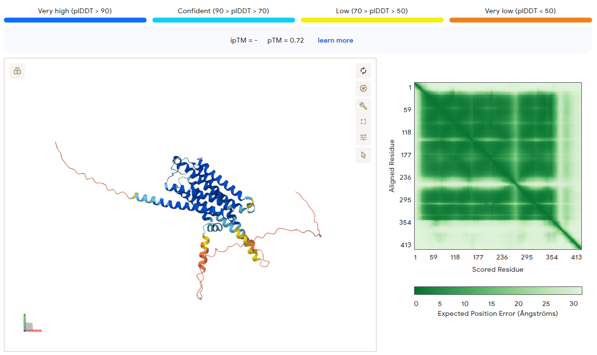
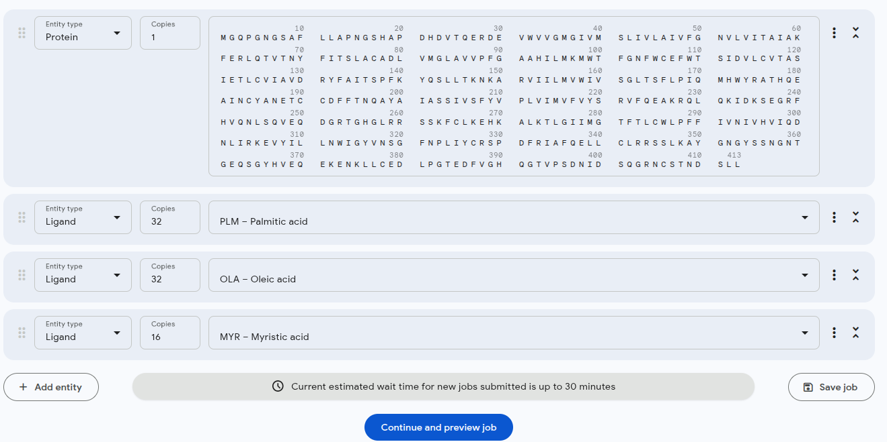
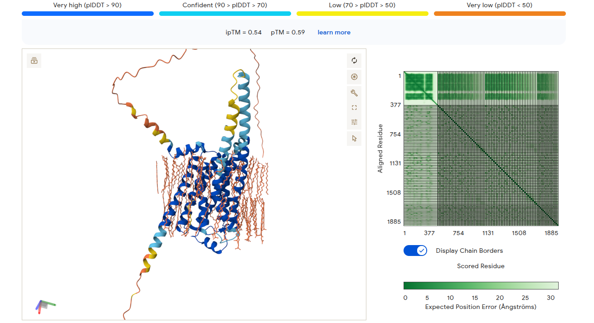
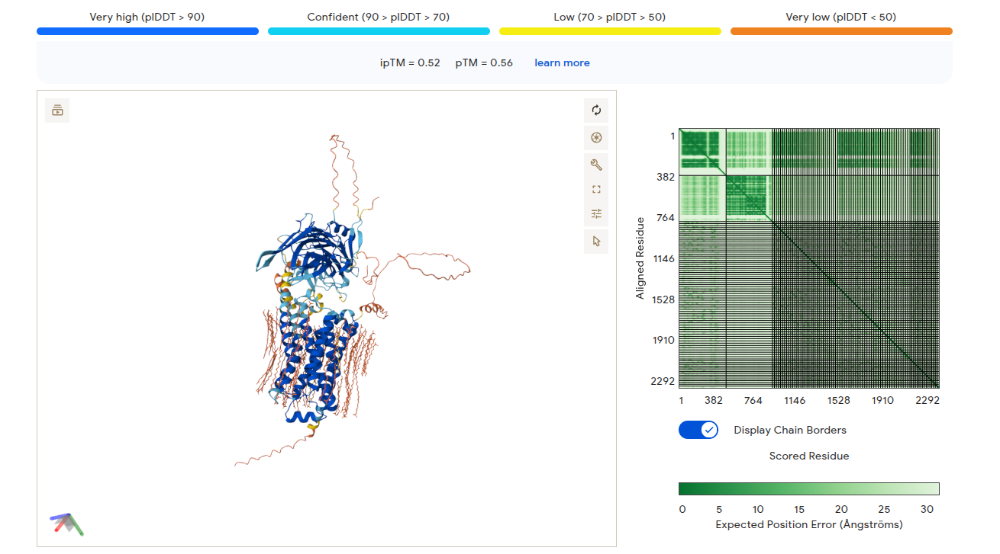
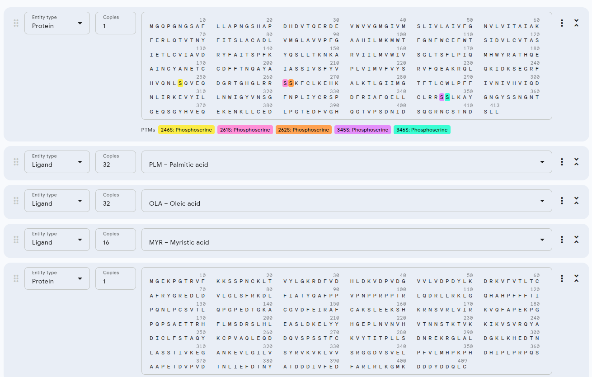
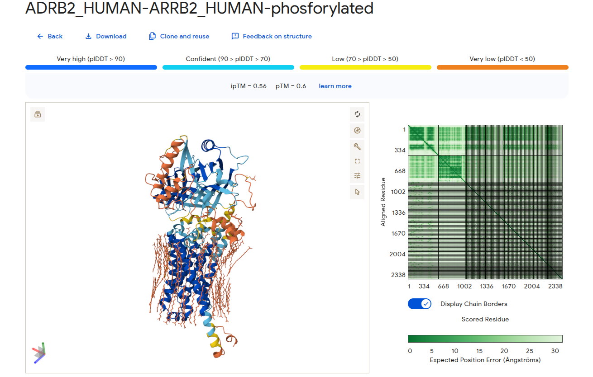

## Exercise: Stepwise Modeling of a GPCR–β‑Arrestin Signaling Complex with AlphaFold 3

G protein–coupled receptors (GPCRs) are the most important class of drug targets in humans: roughly 30–40% of marketed drugs act on GPCRs. The β₂‑adrenergic receptor (ADRB2/β₂AR) is a prototypical class A GPCR and was central to the Nobel Prize in Chemistry in 2012 for studies of GPCR structure. It lives in the plasma membrane, responds to adrenaline, couples to the G_s heterotrimeric G protein, and ultimately increases intracellular cAMP, leading to smooth muscle relaxation and increased heart rate.

β‑arrestins (ARRB1/ARRB2) are multifunctional adaptors that bind activated, phosphorylated GPCRs, block further G‑protein coupling (desensitization), promote receptor internalization, and scaffold alternative signaling pathways. 

In this exercise you will **build up a structural model step by step**:

1.  Start from a **single membrane receptor** (β₂AR).
2.  Put it into a **membrane‑like environment** using fatty acid ligands.
3.  Add the **interacting partner** β‑arrestin‑2.
4.  Introduce **phosphorylation** on the receptor tail and see how this affects the predicted complex.
    

At every stage you will critically evaluate **AlphaFold confidence metrics**:

-   **pLDDT** – per‑residue local confidence (0–100).
-   **PAE (Predicted Aligned Error)** – pairwise confidence in relative positions of residue pairs
- 
The point is not to “believe the structure”, but to learn how to **read the confidence scores**, how membrane context and binding partners change the prediction, and where AlphaFold is clearly telling you *"I don’t know"*.

---

## Biological Background

### β₂‑Adrenergic Receptor (ADRB2)

- Class A GPCR with **seven transmembrane α-helices**.
- UniProt entry for ADRB2:  [https://www.uniprot.org/uniprotkb/P07550/entry](https://www.uniprot.org/uniprotkb/P07550/entry)

### β-Arrestin-2 (ARRB2)

- Cytosolic adaptor protein that binds **activated, phosphorylated GPCR C-termini and intracellular loops**.
-   **Functions:**
    -   Sterically blocks further G protein coupling (desensitization).
    -   Acts as an endocytic adaptor (interacts with clathrin/AP2).
- UniProt entry for ARRB2:  [https://www.uniprot.org/uniprotkb/P32121/entry](https://www.uniprot.org/uniprotkb/P32121/entry)

---

## Input Sequences

Use the following FASTA sequences for β₂AR and β‑arrestin‑2:

```fasta
>sp|P07550|ADRB2_HUMAN Beta-2 adrenergic receptor OS=Homo sapiens OX=9606 GN=ADRB2 PE=1 SV=3
MGQPGNGSAFLLAPNGSHAPDHDVTQERDEVWVVGMGIVMSLIVLAIVFGNVLVITAIAK
FERLQTVTNYFITSLACADLVMGLAVVPFGAAHILMKMWTFGNFWCEFWTSIDVLCVTAS
IETLCVIAVDRYFAITSPFKYQSLLTKNKARVIILMVWIVSGLTSFLPIQMHWYRATHQE
AINCYANETCCDFFTNQAYAIASSIVSFYVPLVIMVFVYSRVFQEAKRQLQKIDKSEGRF
HVQNLSQVEQDGRTGHGLRRSSKFCLKEHKALKTLGIIMGTFTLCWLPFFIVNIVHVIQD
NLIRKEVYILLNWIGYVNSGFNPLIYCRSPDFRIAFQELLCLRRSSLKAYGNGYSSNGNT
GEQSGYHVEQEKENKLLCEDLPGTEDFVGHQGTVPSDNIDSQGRNCSTNDSLL

>sp|P32121|ARRB2_HUMAN Beta-arrestin-2 OS=Homo sapiens OX=9606 GN=ARRB2 PE=1 SV=2
MGEKPGTRVFKKSSPNCKLTVYLGKRDFVDHLDKVDPVDGVVLVDPDYLKDRKVFVTLTC
AFRYGREDLDVLGLSFRKDLFIATYQAFPPVPNPPRPPTRLQDRLLRKLGQHAHPFFFTI
PQNLPCSVTLQPGPEDTGKACGVDFEIRAFCAKSLEEKSHKRNSVRLVIRKVQFAPEKPG
PQPSAETTRHFLMSDRSLHLEASLDKELYYHGEPLNVNVHVTNNSTKTVKKIKVSVRQYA
DICLFSTAQYKCPVAQLEQDDQVSPSSTFCKVYTITPLLSDNREKRGLALDGKLKHEDTN
LASSTIVKEGANKEVLGILVSYRVKVKLVVSRGGDVSVELPFVLMHPKPHDHIPLPRPQS
AAPETDVPVDTNLIEFDTNYATDDDIVFEDFARLRLKGMKDDDYDDQLC
```

---

## Tools and Files You Will Use

### Membrane Topology Prediction: DeepTMHMM

DeepTMHMM uses deep learning to predict membrane topology and classify residues as transmembrane, inside, or outside, and is currently one of the best-performing methods for both α-helical and β-barrel TM proteins. 

https://services.healthtech.dtu.dk/services/DeepTMHMM-1.0/
    
### Structure Viewer: Mol*

[https://molstar.org/viewer/](https://molstar.org/viewer/)

### AlphaFold 3 Server

[https://alphafoldserver.com/](https://alphafoldserver.com/)

AlphaFold Server require Google account to login. The prediction can take from minutes to hours depending on server load. It provides a zip file with 5 best models in mmCIF format. Some tools require PDB format. This can be obtained by conversion from mmCIF on https://project-gemmi.github.io/wasm/convert/cif2pdb.html. The results from AlphaFold 3 are provided here for download to save time - see the links in each part below. These files can be opened directly in Mol* and contain pLDDT scores but not the PAE plot. The PAE plots are provided as images in each part.

---

### Learning Objectives

-   Interpret **transmembrane topology** predictions for a GPCR.
-   Explain what **pLDDT** and **PAE** actually mean and how to read them.
-   Compare **monomer vs. complex** AlphaFold models and assess interface confidence.
-   Discuss how **membrane context** and **phosphorylation** affect model confidence and inferred interactions.

---

## Step-by-Step Workflow

### Part 1 – From Sequence to Membrane Topology: ADRB2 and DeepTMHMM

1. **Obtain the ADRB2 sequence**
   - Use the FASTA above or download from UniProt P07550.

2. **Run DeepTMHMM**
   - Upload the ADRB2 sequence to [DeepTMHMM](https://services.healthtech.dtu.dk/services/DeepTMHMM-1.0/).
   - Record:
     - Number of predicted transmembrane helices.
     - Approximate residue ranges for each helix.
     - Which regions are predicted "inside" (cytosolic) and "outside" (extracellular).


---

### Part 2 – Single-Molecule ADRB2: Inspecting pLDDT and PAE

**Download:** [ADRB2 monomer](https://drive.google.com/file/d/1azRpa6nk_KhXEepobmZ22gQWS0twp1Cu/view?usp=drive_link)


1. **Load the monomer model**
   - Download the **ADRB2 monomer** model.
   - Open it in [Mol*](https://molstar.org/viewer/).

2. **Visualize the structure**
   - Show the protein as **cartoon/trace**.
   - Identify the seven transmembrane helices and compare them to your DeepTMHMM ranges from Part 1.
   - Set pLDDT coloring (Component/Set Coloring/Residue Property/Validation/pLDDT confidence).
   - Compare pLDDT over the **TM bundle** and extracellular/intracellular loops.

3. **PAE (global/domain confidence)**
   - PAE plot is available on results page of AlphaFold 3.
   - What is PAE among residues within the **TM bundle** vs. between loops and TM helices?
            
<details>
<summary>PAE output for ADRB2</summary>




</details>


**Questions**

- Where does AlphaFold show **high local confidence (pLDDT)**? Are these regions structurally sensible (helices, well-packed core)?
- Where are **pLDDT and PAE both poor**? Do these correspond to regions that you would expect to be flexible/unstructured (e.g. C-terminal tail)?
- Based on pLDDT/PAE, which parts of the monomeric model would you trust for **detailed mechanistic interpretation**, and which parts only as a **cartoon** ("something flexible here")?
    

---

### Part 3 – Adding a Membrane Mimic: ADRB2 + Fatty Acids

**Download:** [ADRB2 + fatty acids (membrane mimic)](https://drive.google.com/file/d/1kooPJ6S0wugQF-wvjPoNciEmZCEyELGu/view?usp=drive_link)

Next, we include a membrane-like environment using fatty acid ligands predicted by AlphaFold 3.
One of the inputs for AF3 is protein sequence plus possible ligands. Here, fatty acids are used to mimic the hydrophobic membrane environment.

<details>
<summary>AlphaFold Input</summary>



</details>


- **Load ADRB2 + fatty acids**
  - Download the **ADRB2 + fatty acids** model.
  - Open it in [Mol*](https://molstar.org/viewer/).

- **Identify the membrane plane**
  - Examine where the fatty acids sit relative to the receptor.
  - Check whether the **TM helices** have similar positions.

- **Re-examine pLDDT and PAE**

<details>
<summary>PAE output for ADRB2 + fatty acids</summary>


</details>
            

---

### Part 4 – The Signaling Complex: ADRB2 + β-Arrestin-2

**Download:** [ADRB2 + ARRB2 complex](https://drive.google.com/file/d/1GC311lqfynMZA0Lp9BRKr-7Izxs2CAFv/view?usp=drive_link)

Now we add β-arrestin-2 and look at how well AlphaFold 3 can model the interface.

- **Load ADRB2 + ARRB2**
  - Download the **ADRB2 + ARRB2** model.
  - Open it in [Mol*](https://molstar.org/viewer/).
  - Where does ARRB2 contact ADRB2 (C-terminal tail? intracellular loops?)?
  - Color by pLDDT (B-factor) and compare.

- **Compare PAE among different regions:**
  - PAE within ADRB2 alone.
  - PAE within ARRB2 alone.
  - PAE between ADRB2 and ARRB2.

<details>
<summary>PAE output for ADRB2 + ARRB2</summary>



</details>    

---

### Part 5 – Phosphorylation-Dependent Complex: ADRB2 + Phosphorylation + ARRB2

**Download:** [ADRB2 (phosphorylated) + ARRB2 complex](https://drive.google.com/file/d/1HRGGPBpku7YnLMQV4h7s1Om52EqBHFTL/view?usp=drive_link)

β-arrestin binding typically requires **phosphorylation** of the receptor tail and forms a bipartite interface with the GPCR core and phosphorylated C-terminus. Thus, we finally examine how phosphorylation affects the predicted complex.

AlphaFold 3 server allows adding PTMs such as phosphorylation to the input sequence. Here, several Ser residues in the ADRB2 have been phosphorylated (based on known phosphorylation sites from literature).




- **Load the phosphorylated complex**
  - Download the **ADRB2 (phosphorylated) + ARRB2** model.
  - Open it in [Mol*](https://molstar.org/viewer/).
  - Inspect position of phosphorylated residues (they are part of Component/Non-standard).
  - Are they located in the interface of ARRB2/ADRB2?
  - Was the structure of ARRB2 or ADRB2 changed compared to the non-phosphorylated complex?

<details>
<summary>PAE output for ADRB2 + phosphorylation + ARRB2</summary>


</details>


