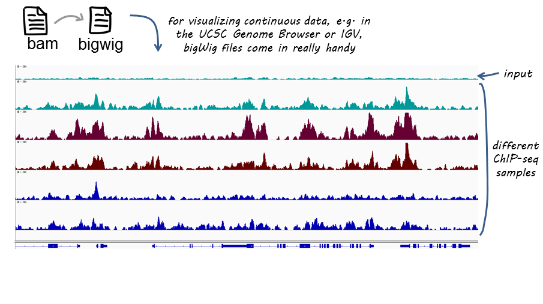

# Integrative Genomics Viewer
The Integrative Genomics Viewer (IGV) is a high-performance, interactive tool for the visual exploration of genomic data. It supports a wide variety of data types and file formats, allowing users to visualize alignments, annotations, and variant calls in the context of a reference genome.

- Multiplatform: Available for Windows, macOS, and Linux.
- Official website and manual: https://software.broadinstitute.org/software/igv/


## Supported File Formats
IGV supports a wide range of file formats, including:

- BAM/SAM: Sequence alignment data.
- BED: Feature tracks.
- BigWig: Continuous data tracks.
- GFF3/GTF: Genomic annotations.
- VCF: Variant call data.


# Custom E.coli data
Data for E.coli genome NC_000913.3 Escherichia coli str. K-12 substr. MG1655, complete genome can be found in `Desktop/Bioinformatics/data/igv_data_e_coli`

For BAM file, you will need to create index file (if does not exist) using command:

```bash
samtools index dna_sequencing.bam
```

- Start IGV
- Load the E. coli Genome: In IGV, navigate to Genomes > Load Genome from File....
- Select the genome file (`genome.fa`)
- Load Data Tracks: Go to File > Load from File....
- Select the data files you wish to load. Available tracks are:
  - `blastp_genes.gff3`
  - `dna_sequencing.bam`
  - `'dna_sequencing coverage.bw'`
  - `genes_de_novo.gff3`
  - `genes_NCBI.gff3`
  - `RNA-Seq_coverage_1.bw`
  - `RNA-Seq_coverage_2.bw`
  - `variants.vcf`


# Types of files included:

## BAM/SAM
A BAM file (.bam) is the binary version of a SAM file.  A SAM file (.sam) is a tab-delimited text file that contains *sequence alignment data*.   These formats are described on the SAM Tools web site: http://samtools.github.io/hts-specs/.

This file can be inspected using
```bash
samtools view dna_sequencing.bam | less -S
```
## BED

A BED file (.bed) is a tab-delimited text file that defines a feature track. It can have any file extension, but .bed is recommended. The BED file format is described on the UCSC Genome Bioinformatics web site: http://genome.ucsc.edu/FAQ/FAQformat. Tracks in the UCSC Genome Browser (http://genome.ucsc.edu/) can be downloaded to BED files and loaded into IGV.

simplest form example:
```tsv
chr11	5246919	5246920
chr11	5255660	5255661
chr11	5247945	5247946
```

## GFF3

A General Feature Format (GFF) file is a simple tab-delimited text file for describing genomic features. This format can be used to describe and visualize gene structure:


## BigWig
The bigWig format is for display of dense, continuous data that will be displayed as a graph:


## VCF
 Variant Call Format, and it is used  encode structural genetic variants. Variant calls include SNPs, indels, and genomic rearrangements.
IGV visualization : https://software.broadinstitute.org/software/igv/viewing_vcf_files

<!--
- update bioinformatics repository
- load E.coli genome from directory ~/Desktop/bioinformatics_git/data/igv_data_e_coli
- load all tracks:
- show coverage after zoom
- colors of genomic reads (grey long inser or single, green shorter insert)
- variants - show coloring
- coverage plot - multiple show group autoscale
-->
# Navigation in IGV
### Navigating using the search bar:
Enter a specific gene, transcript, or genomic coordinate  in the search bar and press Enter to navigate to that location.
Examples:
- Genomic coordinate: `NC_000913.3:34,861-39,466`
- Gene Name:
  -  `carB`
  - `NC_000913.3.g48.t1`
### Navigating using the chromosome ideogram:
Click on a specific chromosome in the ideogram (the graphic representation of chromosomes) to navigate to that chromosome.
Use the mouse to click and drag the chromosome ideogram, which will allow for scrolling through the chromosome.
### Zooming in and out:
- Use the "+" and "-" buttons or the scroll wheel on the mouse to zoom in and out of specific regions.
- Double-click on a specific region to zoom in for a closer look at the genomic features.
- Click and drag the background of the genome browser to pan across the genome horizontally.
### Navigating using bookmarks:
Set bookmarks for interesting genomic regions by clicking on "Region" > "Region Navigator."

Bookmarked regions can be exported and imported using BED format.

# Create custom track for IGV using NCBI BLAST

find region of interest in `genome.fa` which correspond to sequences:
```text
>seq1
GTATGAATACGGAAGGCTTCGGCGACTTTCAGGGATTCGGCCGCCACGTCGATAT
CTTTTTCCACGCAGCGAGCTAACGCACATACGCGGCTGTTTTTAACCTGGCGGGC
GATGGTTTGCACCGATTCAAAATCGCCCGGCGAAGAGACGGGGAAACCGACTTCC
ATCACGTCA
>seq2
TGACCCTGCTGTTCTCCTTCGCTCAGGCTCGTGCTTGTGCGGAAGCGGGCGTGTT
CCTGATCTCGCCGTTTGTTGGCCGTATTCTTGACTGGTACAAAGCGAATACCGAT
AAGAAAGAGTACGCTCCGGCAGAAGATCCGGGCGTGGTTTCTGTATCTGAAATCT
ACCAGTACT
>seq3
CGCGTCCGGCGCTGCGTTTTGTAGCCCGCTCTGGCTTGCGGGAAGTGTTTAGTGC
CGT
>seq4
AGCACGAAGCCGTTATTGACGACGGCTGCGACTTTATCGACTACCTGGGGGGCAG
CGAAACTGGTATTCGCGATCATGGCGATACCGAGAAGCAGCGTTTTCCAGTTCTT
CATACTTTATCCATTTCAATTATCCGCACTGCGGATTACGTGGTAAATCAACAAA
TCACAAAGTGTTTTGATACGGCAGAATGTTCGAACGCAGCATCTCTTGCGTACCC
AGACCGTAGTTGGAGCTCAGGCGGCGAAGTTCGATGTTAAAGCCGATTGCGTTGT

```

create text file with FASTA sequences and save it as `query.fasta` to IGV directory

```bash
mkdir IGV
cd IGV
gedit query.fasta ## insert sequences and save
# make copy of genome
cp ~/Desktop/Bioinformatics/data/igv_data_e_coli/genome.fa .
makeblastdb -in genome.fa -dbtype nucl
blastn -query query.fasta -db genome.fa -outfmt '6 sseqid sstart send qseqid pident' -out regions.bed
# inspect regions bed file
```

File `regions.bed` can be either loaded as track (`File/Load from File`) or from  `Regions` menu. Try both ways
