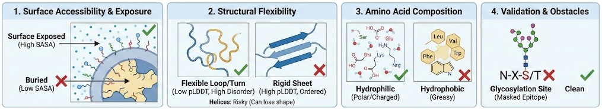

# Epitope Selection Exercise for Antibody/Vaccine Design

## Scenario

A new strain of Nipah Virus has emerged. Your team needs to rapidly identify surface regions on the viral Attachment Glycoprotein (G) that are accessible, flexible, and immunogenic to design a neutralizing antibody or peptide vaccine.

---

## 1. Structure Prediction

We need the 3D structure of the viral surface protein to understand where antibodies can bind. Since this is a "novel" strain, we assume no crystal structure exists yet.

Amino Acid Sequence (FASTA format):

```fasta
>NIPAV_GLYCOPROTEIN
MPAENKKVRFENTTSDKGKIPSKVIKSYYGTMDIKKINEGLLDSKILSAFNTVIALLGSI
VIIVMNIMIIQNYTRSTDNQAVIKDALQGIQQQIKGLADKIGTEIGPKVSLIDTSSTITI
PANIGLLGSKISQSTASINENVNEKCKFTLPPLKIHECNISCPNPLPFREYRPQTEGVSN
LVGLPNNICLQKTSNQILKPKLISYTLPVVGQSGTCITDPLLAMDEGYFAYSHLERIGSC
SRGVSKQRIIGVGEVLDRGDEVPSLFMTNVWTPPNPNTVYHCSAVYNNEFYYVLCAVSTV
GDPILNSTYWSGSLMMTRLAVKPKSNGGGYNQHQLALRSIEKGRYDKVMPYGPSGIKQGD
TLYFPAVGFLVRTEFKYNDSNCPITKCQYSKPENCRLSMGIRPNSHYILRSGLLKYNLSD
GENPKVVFIEISDQRLSIGSPSKIYDSLGQPVFYQASFSWDTMIKFGDVLTVNPLVVNWR
NNTVISRPGQSQCPRFNTCPEICWEGVYNDAFLIDRINWISAGVFLDSNQTAENPVFTVF
KDNEILYRAQLASEDTNAQKTITNCFLLKNKIWCISLVEIYDTGDNVIRPKLFAVKIPEQ
CT
```


- Analyze the protein sequence on https://alphafoldserver.com/ (it is necessary to use a Google login).
  > **Note:** AlphaFold predictions can take from minutes to hours depending on server load. It provides a zip file with 5 best models in mmCIF format. Some tools require PDB format. This can be obtained by conversion from mmCIF on https://project-gemmi.github.io/wasm/convert/cif2pdb.html 
- Alternatively, you can download the structure directly from the link below:
  - https://drive.google.com/drive/folders/1tYiYlAWAtlc3gXz8w_WYushtdwatg1ZT?usp=sharing
  - There are two files, one in PDB format and one in mmCIF format. Download both of them:
     - `fold_glycp_nipav_model_0.cif`
     - `fold_glycp_nipav_model_0.pdb`

- Go to Mol* Viewer (https://molstar.org/viewer) and upload the mmCIF file.
- Set coloring to pLDDT (Set Coloring/Residue Property/Validation/pLDDT confidence).
- Look at the pLDDT (confidence) coloring:
   - Which parts are blue (confident/structured)?
   - Which parts are yellow/orange (low confidence/disordered)?

Low pLDDT often correlates with natural disorder, not just "bad prediction."

## 2. Disorder Analysis

Antibodies often bind better to flexible loops on the protein surface (induced fit) rather than rigid, flat surfaces. We need to find these "wobbly" bits.

**Tool:** AIUPred - Prediction of Intrinsically Unstructured Proteins

- Go to https://aiupred.elte.hu/
- Input the same FASTA sequence from Phase 1.
- Run the prediction (use "AIUPred-binding").
- Analyze: Identify peaks above the 0.5 threshold.
- Do these peaks correspond to the "low confidence" (yellow/orange) regions you saw in AlphaFold?

---


## 3. Identification of Suitable Epitopes

### Guidelines for Selecting Epitopes for Antibody Generation

**Best to Worst Structural Targets:**

- **Flexible loops and turns** are ideal targets – These naturally disordered regions are surface-exposed and flexible, allowing antibodies to bind through induced fit. Synthetic peptides naturally adopt flexible conformations in solution, perfectly mimicking native loops.
- Look for **high surface accessibility** – Your epitope must be exposed to solvent (>25-50% accessible surface area). The amino acid side chains should protrude into the water, not be buried inside the protein core.
- Prefer **hydrophilic, charged regions** – Choose sequences rich in polar residues (S, T, N, Q) and charged amino acids (D, E, K, R). Avoid stretches of hydrophobic residues (L, V, I, F, W), which typically indicate buried regions.
- **Alpha-helices are risky but possible** – Surface-exposed helices can be epitopes, but short synthetic peptides often lose their helical structure in solution and become random coils. The antibody may then fail to recognize the rigid helix on the native protein. Only choose helices if you understand this limitation.
- **Avoid beta-sheets** – Beta-strands are stabilized by hydrogen bonding with neighboring strands. A single peptide extracted from a beta-sheet context will collapse or aggregate and won't represent the native structure.
- **Protruding geometry works better than flat surfaces** – Antibodies bind more effectively to "bumps" or projecting features than to flat surfaces. Look for regions that stick out from the protein structure.

A suitable epitope length for antibody design is generally 10-20 amino acids, with 15 residues often recommended as a good starting point for linear peptides.




To select potential epitopes we will use [DiscoTope 3.0](https://services.healthtech.dtu.dk/services/DiscoTope-3.0/), which predicts discontinuous B-cell epitopes from 3D structures.


- Go to DiscoTope 3.0: https://services.healthtech.dtu.dk/services/DiscoTope-3.0/
- Upload the **PDB** file you generated in Phase 1 (AlphaFold).
- Run the prediction.
- Analyze the results: The tool will color-code the 3D model by "Epitope Propensity."
- Inspect the 3D structure in the viewer.
- Download the resulting zip file containing the scores.
- Find a region that is:
  - **Red/High Score** in DiscoTope (good epitope)
  - **Surface exposed** (visible on the outside)
  - Use the guidelines above to pick the best candidate epitope (10-20 residues).

---

## 4. Glycosylation Site Analysis

A great epitope is useless if it's covered in sugars (glycans) that block antibodies.

- Use the tool [NetNGlyc](https://services.healthtech.dtu.dk/services/NetNGlyc-1.0/) to predict N-linked glycosylation sites on your selected epitope.
- NetNGlyc predicts N-linked glycosylation sites in proteins using artificial neural networks that examine the sequence context of Asn-Xaa-Ser/Thr motifs (where Xaa can be any amino acid except proline).
- Use the FASTA sequence of the Nipah Virus Glycoprotein (from Phase 1) as input.
- Record any predicted N-glycosylation sites within your chosen epitope region.
- Check if your chosen "best epitope" region(s) contains predicted glycosylation sites. If so, reconsider your choice and select an alternative epitope that is not glycosylated.
- Open the CSV file from DiscoTope output in spreadsheet software (Excel, LibreOffice Calc) and compare with glycosylation sites.

> **Note:** Many pathogens, like HIV, cover themselves with a dense layer of glycans to act as a shield, hiding their vulnerable parts from the immune system.

---

### Visualizing Glycosylated Structure

When modeling structure with AlphaFold, it is possible to add post-translational modifications including glycosylation. A model with glycosylated sites can be downloaded from: https://drive.google.com/drive/folders/1tYiYlAWAtlc3gXz8w_WYushtdwatg1ZT?usp=sharing

- File name: `fold_nipav_with_glycosylated_model_0.cif`
- Download and open it in Mol* Viewer (https://molstar.org/viewer) to visualize glycosylated sites on the structure.


## 5. Final Epitope Selection

Based on your analyses from Phases 1-4, select the best epitope region for antibody or vaccine design. Justify your choice.