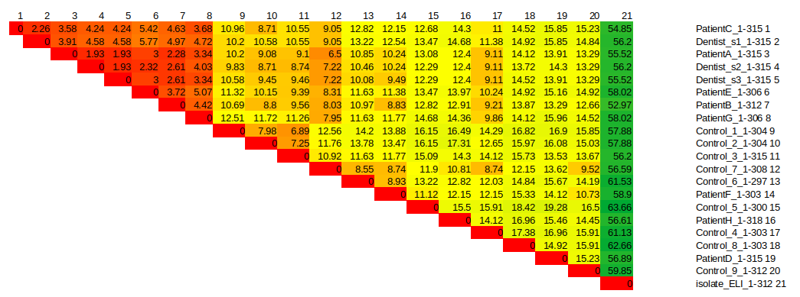

# The case of the Florida dentist

This exercise is based on a real incident that occurred in Southern Florida in the 1990s, involving a dentist and a group of patients who claimed to have contracted HIV from their dental practitioner. If this assertion holds true, we would expect the HIV virus isolated from the dentist to be more closely related to the patients' virus than to other 'control' sequences from the wider population. To test this hypothesis, we will compare HIV gene sequences isolated from the dentist, his patients, and the wider population, using these alignments to construct a phylogenetic tree.

We will utilize the *env* gene, which codes for the outer coat of the HIV virus. The *env* sequences, obtained via PCR from the patients,dentist (three samples), control samples and outgroup, are available at the following link: https://raw.githubusercontent.com/kavonrtep/bioinformatics/master/data/phylogenetic/hiv_env_renamed.fna

List of DNA sequences in the file:

Control from Florida area:
- Control_1
- Control_2
- Control_3
- Control_4
- Control_5
- Control_6
- Control_7
- Control_8
- Control_9

Three isolates from the dentist:
- Dentist_s1
- Dentist_s2
- Dentist_s3

Outgroup from Africa:
- isolate_ELI

Patients:
- PatientA
- PatientB
- PatientC
- PatientD
- PatientE
- PatientF
- PatientG
- PatientH

Instructions:
1. Create a multiple sequence alignment (MSA) using the *env* sequences. Use mafft program with option  and `--reorder`:

```shell
mkdir hiv_env 
cd hiv_env
cp ~/Desktop/Bioinformatics/data/phylogenetic/hiv_env_renamed.fna .
mafft --reorder hiv_env_renamed.fna > hiv_env_aligned.fna
```
2. Inspect the MSA file using Jalview program. Inspect end of the alignment to see if all sequences are aligned. Are there any gaps in the alignment at the end of the sequences? Try to identify parts of sequences which should be removed from the alignment. If necessary trim the alignment in Jalview and save it as a new file. Name the trimmed file `hiv_env_aligned_trimmed.fna`.

Optional: calculate NJ tree in Jalview from trimmed and untrimmed alignment. Compare the trees.

3. Calculate the genetic distances between the sequences in the MSA file. Use the distmat program with the following command:

```shell
distmat --help
distmat -sequence hiv_env_aligned.fna -nucmethod 1 -outfile hiv_env_distances.csv
distmat -sequence hiv_env_aligned_trimmed.fna -nucmethod 1 -outfile hiv_env_trimmed_distances.csv
```

4. Import the distance matrix to LibreOffice Calc or Excel and visualize it as a heatmap using conditional formatting. Set conditional formatting to color cells based on value. What do you observe? Evaluate the distances between the dentist, patients, and control sequences and outgroup. What can you infer from the distance matrix?

<details>
<summary>Example of distance matrix</summary>



Interpreting the HIV Distance Matrix

### What the heatmap actually shows

This is a genetic distance matrix. In simple terms: low numbers = high similarity, high numbers = low similarity.
-   **Low values (red/orange):** Recent common ancestor; little time to mutate.
-   **High values (yellow/green):** Long-term independent evolution.
  
###  Interpreting the groups

#### The Outgroup (Isolate\_ELI)

The right-most column is uniform dark green (~55–60).  
This tells us the African isolate is far removed from all Florida samples. Good sanity check—confirms the Florida sequences are all within the same subtype and comparable to each other.

#### Background variation (Controls)

Control\_1–Control\_9 form a yellow block (11–17%).  
This defines the “normal” genetic distance between unrelated HIV cases in Florida. Expect ~12–15% difference when there’s no epidemiological link.

#### The key signal (Dentist vs Patients)

Top-left corner shows the relevant comparisons: Dentist vs Patients A, B, C, E, G.

These values are dramatically lower than background. The chance of seeing distances this small by coincidence is effectively zero. The data support a direct transmission link between the dentist and these patients.

#### The non-linked patients

Patients D, F, and H show distances in the 11–15% range relative to the dentist—indistinguishable from random controls.  
These infections are unrelated to the dentist despite the shared clinic visit.


Overall the matrix supports a coherent transmission cluster: Dentist + Patients A, B, C, E, G 
    
</details>
<hr>


5. Construct a phylogenetic tree using the MSA file. Use the PhyML program on Galaxy server. Server is available at https://galaxy.pasteur.fr

Use Phyml-SMS program with default settings. This script runs SMS to select the substitution model which best fits the input data. It also runs PhyML with the selected model.

6. Download tree file in Newick format and visualize it using Dendroscopeprogram. Alternatively tree can be visualized using web-based Presto tool http://www.atgc-montpellier.fr/presto/

7. Use command tool to color dentist, patients, and control sequences in the tree. Use the following command:

```dendroscope
find searchtext='Dentist' target=nodes regex=true;set labelcolor=#AA0000;deselect all; 
find searchtext='Patient' target=nodes regex=true;set labelcolor=#00AA00;deselect all;
find searchtext='Control' target=nodes regex=true;set labelcolor=#0000AA;deselect all;
```
8. Select outgroup and use Edit/reroot on outgroup to root the tree.

9. Answer the following questions:
   - Are the sequences from the dentist more closely related to the patients or the control sequences?
   - What can you infer from the phylogenetic tree about the origin of the HIV sequences in the dentist and patients?
   - Which patients are most likely to have contracted the virus from the dentist if any?
   - Is divergence in control sequences higher than in the dentist and patients?
