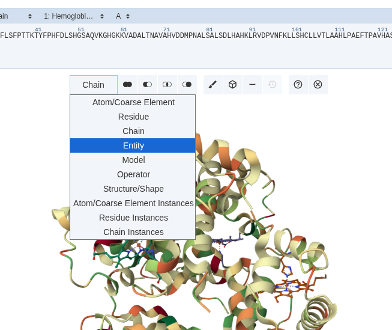
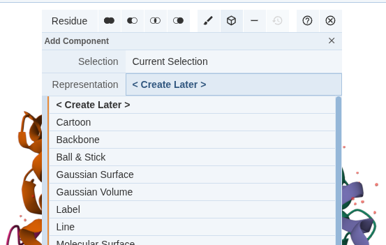
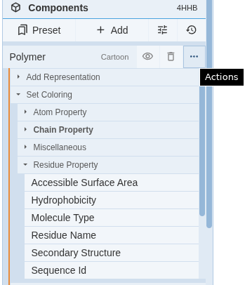
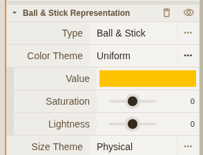
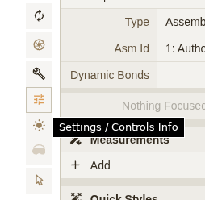
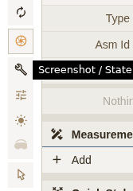

# Mol* viewer introduction
Mol* (Molstar) is a web-based molecular visualization tool designed for high-performance rendering of large biomolecular structures. It is widely used in structural biology for visualizing proteins, nucleic acids, and complexes at atomic resolution. Mol* is accessible through web browsers and integrates with various databases, including the Protein Data Bank (PDB).

- Standalone Mol* can be accessed at: https://molstar.org/
- Manual: https://molstar.org/viewer-docs/

## Accessing Mol* in RCSB PDB
Mol* is the default 3D viewer on the RCSB PDB website. Go to RCSB PDB (https://www.rcsb.org/) and search for a structure `4HHB`. Click on the "3D View" tab to launch Mol* and explore the structure interactively.

### Layout Overview
- Center (3D Canvas): This is where your molecule is displayed. You can use your mouse to rotate and zoom the structure.
  - Controls:
    - Left-click + drag: Rotate
    - Right-click + drag: Pan
    - Scroll wheel: Zoom in/out
- Top (Sequence Panel): Shows the amino acid sequence of the protein chains. 
   - Pointing on a residue will highlight it in the 3D view.
   - Clicking a residue will zoom into that part of the structure
- Right (Controls Panel): Contains all tools for visualization, measurements, and export.
   - Components List: Located in the Controls Panel. It lists Polymers, Ligands, Waters, and Ions. You can click the "eye" icon next to any component to hide or show it
   - Measurements: Provides measuring options such as the distance between atoms and torsional/dihedral angles (angle between 4 connected atoms,...).

---

Now, familiarize yourself with the basic functions of zooming, rotating, and translating
the structure, and resetting the camera:
-  Try scrolling the mouse to zoom the structure (when the mouse is in the structure
window pane)?
-  What does moving the mouse around while left-clicking do to the structure?
-  What does moving the mouse around while right-clicking do to the structure?
-  What does the Reset Camera do to the view?
- Try to click on a residue in the sequence panel. What happens in the 3D view?
- Click on part of the structure in the 3D view. What happens in the sequence panel? Click on the same residue again. See what happens.
- Click on the empty space in the 3D view.
- Focus on Ligands.

---

### Top horizontal toolbar

The top horizontal toolbar can be used to switch between loaded structures and sequences of individual chains (A, B, C, D) or ligands.

### Hiding/showing components
In the right control panel, you can hide/show components of the structure by clicking on the "eye" icon next to each component in the Components list.
- Try hiding the water molecules. What happens to the structure in the 3D view?
- Hide/show ions - what ions are present in this structure?
- Try hiding the protein chains.

### Selection & Styling

- Activate Selection Mode - Click the Arrow Cursor icon (Toggle Selection Mode) at the left part of the 3D canvas.
- Click on residues in the 3D view or the Sequence Panel to select them.
- To clear a selection, click on any empty white space in the background.
- Select Specific Entities (e.g., chains, residues).
- 

#### Example of styling:

- Select one "Heme" group.
- With an item selected (e.g., a Heme group), go to the Selection Menu and click the 3D box icon (Representations).
- Choose a style like "Spacefill" to see its volume.
- Click "Create Component". This creates a new item in the Right Panel that you can control independently.
- Change Color - with your new component created, click the Paintbrush icon in the Selection Menu.
- Choose a color (e.g., Yellow) to apply it to your selection.

#### Coloring based on properties - example of coloring based on hydrophobicity:

On the right-hand menu, in the "Polymer" subsection, click on the "Action" button,
which is the three-dots in a row.
- Click on "Set Coloring."
- Click on "Residue Property."
- Click on "Hydrophobicity."
- In this rendering, the most hydrophobic amino acids (or residues) will be green, and the
most hydrophilic amino acids will be red.

Test also other properties:
- Molecule type
- Secondary structure
- Sequence ID (this will color based on N to C terminus orientation)
- Chain Property/chain ID

### Hydrophobicity on membrane proteins

- Explore the coloring by hydrophobicity on a membrane protein structure, such as Human cannabinoid receptor CB2 - PDB accession `5ZTY`.
- Can you identify the transmembrane regions based on the hydrophobicity coloring?

### Viewing amino acid side chains

- Find PDB `1DXZ` entry, which is the M2 Transmembrane Segment of the Nicotinic Acetylcholine Receptor Alpha-Subunit.
- Which amino acids are ~1 turn away from Met 243?
- Identify Met 243 in the 3D view or in the sequence view.
- When hovering over an amino acid letter, a textbox with the amino acid name and number will appear at the bottom right of the application window.
- When clicking on "M", all of the side chains within 5 Å will appear. Identify the amino acids that are one turn away from Met 243.
- Note: alpha-helix has 3.6 residues per turn, so one turn away is ~4 residues away in the sequence.

### Viewing molecular surfaces

Load crystal structure of the hexameric anti-microbial peptide channel dermcidin (PDB ID: `2Y5T`). Inspect the interior surface of the channel. Is the channel interior hydrophobic or hydrophilic? Is the interior hollow or filled with atoms?

Go to the RCSB PDB (https://www.rcsb.org) and search for the PDB ID `2Y5T`.

- How many alpha helices are visible in the structure?
- Change the Polymer coloring to "Hydrophobicity."
- Rotate the structure until you can see down the central channel.
- Do the non-polar residues (amino acids) point towards the inside or outside of the
channel, and what about the polar residues?
- In default ribbon representation, you do not see the actual surface of the channel; the space is empty but in reality it is filled with side chains of amino acids. To see the actual surface, we need to add Molecular Surface representation.
   - First, click on the "Action" button for the "Polymer" settings.
   - Then, click on "Add Representation."
   - Click on "Molecular Surface."
   - Rotate the structures.
   - Add the same coloring by hydrophobicity to the surface representation.
   - Is the central channel occluded or open?
   - Zoom into the channel and inspect the surface.

Note: Individual representations can be hidden/shown by clicking the "eye" icon next to each representation in the right control panel.

### Non-covalent interactions

- Load PDB entry `2BEG`.
- Under the "Chain" option (See Figure 3), choose chain A.
- From the structure window, click on D 23.
- When clicking on D23, all of the side chains within 5 Å will appear.
- Rotate this structure to obtain a good view of the side arm of D23.
- The side arm of D23 is interacting with which amino acid, and from which chain?
- Inspect the interaction between chain A and other chains. What types of non-covalent interactions can you identify?
- Are beta-sheets in parallel or anti-parallel arrangement?

### Superpose the structures - Align two different structures to compare them.
Structural alignment can be used to directly compare different 3D "states" of a protein – for example, an experimental structure vs. an AlphaFold model, or an apo protein vs. the same protein bound to a cofactor. By superposing these structures, we can see which parts of the fold are conserved and which regions move, rearrange, or only appear upon binding. This reveals how binding, mutations, or different conditions change the protein's shape, and helps connect structure to function.

---

Compare `4HHB` PDB structure with AlphaFold model `AF-P69905-F1` of the same protein.

- Go to [molstar.org](https://molstar.org/)
- In the left control panel use Download Structure option to load PDB structure `4HHB`
- Next, use a Download Structure option again to load AlphaFold model `AF-P69905-F1`
- What is the difference between the two structures?
- Set coloring of Polymer to Model Index to distinguish between the two structures.
- Are the structures aligned?
- To align the two structures:
   - Switch to selection mode (arrow symbol), set selection mode to "Chain" (to toolbox)
   - Select AlphaFold chain and one of alpha subunits from PDB structure
   - In the right control panel, click on Superposition and select "Chain"
   - Click "Superpose"
- Check the alignment statistics in the bottom log panel - What is the RMSD between the two structures?
- Root Mean Square Deviation (RMSD) is a measure of the average distance between atoms of superimposed proteins. A lower RMSD indicates a better alignment.
- Add additional representation to aligned chains so we can see the differences in side chains.

### Create a visually informative representation of a leucine zipper domain.

Visualizing a leucine zipper and highlighting its leucine and valine residues helps turn the idea of a “coiled-coil with a hydrophobic core” from an abstract concept into something you can clearly see. Showing these side chains packed together inside the helix makes it easier to understand how the structure is stabilized and why certain positions matter. Cleaning up the view and exporting a clear image also gives a practical example of how to create simple, publication-ready figures that communicate this principle effectively.

- Structure: PDB ID 1DGC (GCN4 bZIP bound to ATF/CREB site DNA). It is a basic leucine zipper (bZIP) transcription factor forming a coiled-coil leucine zipper dimer with DNA.
- The leucine zipper is the dimerization domain: two alpha-helices from different chains pack together, with leucine residues forming a hydrophobic stripe along each helix.
- We will visualize the hydrophobic core of this coiled-coil by highlighting Leu and Val residues.
---

 - Loading 1DGC in Mol*:
   - Go to [molstar.org](https://molstar.org/).
   - In the left control panel use Download Structure option to load PDB structure `1DGC`.
 - Hiding solvent and ions: if water molecules and ions are present in the structure, hide them to declutter the view. This is common in crystallographic structures.
- Simplify representations:
  - For protein chains: set the main representation to Cartoon (if not already).
  - For DNA: Use Molecular Surface (optional).
- Identify Leu and Val residues in both chains:
  - In selection mode, set the selection type to "Residue."
  - Identify and select Ile, Leu and Val residues in both chains. You can use the sequence panel or click directly on residues in the 3D view.
- Change the representation of selected residues to Ball & Stick or Spacefill to highlight them.
- Change the color of these residues to a distinct color (e.g., yellow) to make them stand out against the rest of the structure.
  - In the corresponding "Ball & Stick" representation, set color to "Miscellaneous/Uniform".
  - Then use three dots "Action" button to set the color to yellow.

  - Adjust the View, Background, and Lighting:
    - Adjust the camera angle to get a clear view of the leucine zipper interface.
    - Set the background and lighting - use Settings / Controls Info.

    

- When you're satisfied with the view, export the image with Screenshot option.

