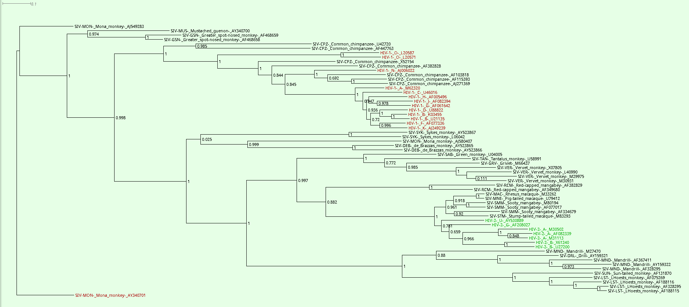

## Phylogenetic Analysis of HIV to Determine Its Origin in African Primates 

### Introduction 

Human Immunodeficiency Viruses (HIV-1 and HIV-2) are closely related to Simian Immunodeficiency Viruses (SIVs) found in various African primate species. Understanding the evolutionary relationships between HIV and SIV strains can reveal the origins of HIV and its transmission pathways from primates to humans. This guide outlines the steps to perform a phylogenetic analysis of HIV sequences using open-source tools to determine their primate origins.

### Objectives 

- Align HIV and SIV DNA sequences.
- Inspect and refine the sequence alignment.
- Construct a phylogenetic tree.
- Visualize and analyze the phylogenetic tree to infer the origins of HIV.

### Step-by-Step Guide 

#### 1. Sequence Alignment with MAFFT 
**MAFFT**  is used to create a multiple sequence alignment of HIV and SIV DNA sequences. Data for alignment are located in `~/Desktop/Bioinformatics/data/phylogenetic/HIV_sequences.fasta`


```bash
cd
mkdir hiv_origin
cd hiv_origin
cp ~/Desktop/Bioinformatics/data/phylogenetic/HIV_sequences.fasta .
mafft --auto HIV_sequences.fasta > HIV_sequences_aligned.fasta
```
> Note: MAFFT alingment can take couple of minutes depending on the number of sequences.


#### 2. Inspect Alignment in Jalview 

Inspect the alignment using **Jalview** to ensure quality and make any necessary adjustments. What is overall quality of the alignment? Are there any regions with poor alignment that need to be trimmed or corrected?
  

#### 3. Construct Phylogenetic Tree Using Galaxy’s PhyML-SMS 

  - Go to [Galaxy Pasteur](https://galaxy.pasteur.fr/) .
  - Click on `Upload Data`.
  - Select and upload `HIV_sequences_aligned.fasta`.
  - In the tools panel, search for **PhyML-SMS** .
  - Select the **PhyML-SMS**  tool from the search results.
  - Configure PhyML-SMS Parameters** : 
     - **Alignment file** : `HIV_sequences_aligned.fasta`
     - **Data type** : DNA
     - Other parameters - default
 
> Note : PhyML-SMS may take longer time to finish depending on the number of sequences. Backup of the precomputed results is avalable in Galaxy history: https://galaxy.pasteur.fr/u/petrnovak/h/origin-of-hiv
 
#### 4. Inspect output from PhyML-SMS

There are four output datasets: 
 - SMS compare models
 - PhyML newick tree
 - SMS Best Model
 - PhyML Statistics

 - Download the tree in Newick format for visualization.

#### 4. Visualize and Analyze the Tree in Dendroscope 
  - Open Dendroscope 
  - Navigate to `File` > `Open` and select the downloaded tree file.
  - Find `SIV-MON;_Mona_monkey;_AY340701` and set it as outgroup
  - Identify major groups and subtypes of HIV-1 and HIV-2. You can use command window to select and color HIV-1 and HIV-2 leaves:
```
find searchtext='HIV-1' target=nodes regex=true;set labelcolor=#AA0000;deselect all; 
find searchtext='HIV-2' target=nodes regex=true;set labelcolor=#00AA00;deselect all;
```    
  - Examine the placement of SIV strains to infer the origins of HIV-1 and HIV-2.
  - Determine from which **African** primates HIVs originated (You have to exclude Non-African primates such as Pig-tailed macaque, Stump-tailed macaque and Rhesus macaque).
  - Do you think that transmission occurred just once or multiple times?


<details>summary>Solution</summary>



1. General Topology and Outgroup
  - Rooting: By setting SIV-MON (Mona Monkey) as the outgroup, the tree is rooted, giving it a direction of time from left to right.
  - The Major Split: The tree immediately splits into two distinct, massive clades. This indicates that HIV-1 and HIV-2 are not direct relatives of each other. They are as distinct from one another as they are from many other monkey viruses. They represent two completely separate viral lineages.

2. The Origin of HIV-1 (The Red Clade)
  - Observation: Look at the top half of the tree where the HIV-1 sequences (colored red) are located.
  - Sister Taxa: The branches immediately connecting to the HIV-1 clusters are labeled SIV-CPZ. CPZ stands for Chimpanzee (Pan troglodytes).
  - Conclusion: HIV-1 is the result of a zoonotic transmission (spillover) from Chimpanzees to Humans.

3. The Origin of HIV-2 (The Green Clade)
  - Observation: Look at the bottom half of the tree where the HIV-2 sequences (colored green) are located.
  - Sister Taxa: These sequences cluster tightly with SIV-SMM, SIV-MAC, and SIV-STM.
  - Host Identification:
     - SIV-SMM: Sooty Mangabey (Cercocebus atys).
     - SIV-MAC / SIV-STM: Rhesus and Stump-tailed Macaques.

The **"African"** Constraint: The instructions explicitly ask to exclude non-African primates. Macaques are Asian primates. Historically, captive Macaques contracted SIV in research centers from Sooty Mangabeys. Therefore, the natural reservoir in Africa is the _Sooty Mangabey_.

Conclusion: HIV-2 originated from a cross-species transmission from Sooty Mangabeys to Humans (likely in West Africa, where these monkeys are hunted for bushmeat).

4. Single vs. Multiple Transmission Events
  - The Question: Did HIV jump to humans once (one "Patient Zero") or multiple times?
  - Evidence in the Tree:
  - Look closely at the HIV-1 clade. All HIV-1 sequences do not form a single "monophyletic" group (a single branch) that separates perfectly from Chimpanzees.
  - Instead, you see Group O (HIV-1_O) branching off separately, closer to certain SIV-CPZ strains.
  - Group M (the major pandemic group including subtypes A, B, C, etc.) branches off elsewhere.
  - Group N clusters with yet another distinct SIV-CPZ lineage.

Conclusion: This "interspersed" branching pattern proves that multiple independent transmission events occurred. Humans were infected by Chimpanzees on at least three or four separate occasions, giving rise to the different HIV-1 groups (M, N, O, and P). The same pattern holds true for HIV-2 and Sooty Mangabeys.

Summary of Results:

| Virus Type | Closest SIV Relative | Primate Host Origin |
|------------|----------------------|---------------------|
| HIV-1      | SIV-cpz              | Common Chimpanzee   |
| HIV-2      | SIV-smm              | Sooty Mangabey      |

Key Takeaway: HIV is not a single entity with a single origin. It is a result of multiple zoonotic spillovers from at least two different primate species (Chimpanzees and Sooty Mangabeys) into human populations.

</details>

