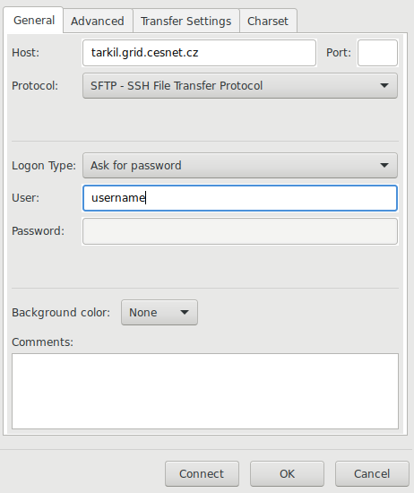

# Exercise 1 - Assembly Sanger sequence reads using Staden program

-   Available for Linux, Windows and MacOS - <http://staden.sourceforge.net/>
-   Concise tutorial : <https://bioinf.comav.upv.es/courses/intro_bioinf/_downloads/5521cd30ca085b97175a9d32ce58f517/staden_course.pdf>
-   Detailed manual : <http://bioinformatics.se/tools/staden/staden_package_manual.pdf>

## Main Staden programs:

### trev

Viewer and editor of trace files

### pregap4

Pregap is used to process raw traces. It masks low quality sequences, sequencing primers and vector sequences.

### gap4

Gap is the Genome Assembly Program – the program which actually assembles your individual fragments into long contigs. It allows you to edit the assembly, referring back to the starting traces where they are present.

## Data for assembly:

Data for assembly are located in `~/Desktop/bioinformatics/data/sanger`

# Exercise 2 - Assembly from short NGS reads using Velvet program

## Part 1 - Single End Reads:

### Installation of necessary programs

```bash
# you will have to run in on VM as administrator
su root   # enter administrator password
mamba create -n assembly -y -c bioconda jellyfish fastx_toolkit quast samtools fastqc multiqc bowtie2 velvet hifiasm
exit  # exit from root user
conda activate assembly
```

### Single-end library

1.  Data

    The data you will examine is from *Staphylococcus aureus* USA300 which has a genome of around 3MB. The reads are Illumina and are unpaired, also known as single-end library. The data needed for this section can be obtained from the Sequence Read Archive (SRA). For the following example use the run data SRR022825 and SRR022823 from the SRA Sample SRS004748. The SRA experiment can be viewed by setting your browser to the URL:
    <http://www.ebi.ac.uk/ena/data/view/SRS004748>

    Create directory for assembly:

    ```bash
    cd
    mkdir ngs_assembly
    cd ngs_assembly
    ```

    Data can be obtained directly using either the wget command:

    ```bash
    wget ftp://ftp.sra.ebi.ac.uk/vol1/fastq/SRR022/SRR022825/SRR022825.fastq.gz
    wget ftp://ftp.sra.ebi.ac.uk/vol1/fastq/SRR022/SRR022823/SRR022823.fastq.gz
    ```

    Or using fastq-dump from NCBI-SRA, which is a utility for downloading data from the NCBI-SRA database:

    ```bash
    fastq-dump --gzip SRR022825
    fastq-dump --gzip SRR022823
    ```

### Quality control using FASTQC program

Run FASTQC program on Illumina reads:

```bash
fastqc *.fastq.gz
```

This command will create HTML reports:

-   `SRR022825_fastqc.html`
-   `SRR022823_fastqc.html`

Inspect the reports and answer:

-   What is the sequence read length?
-   How many sequences are in the single runs?
-   What is the total number of bases?
-   What is the sequencing coverage?

### Estimation of genome size:

We will use a k-mer-count-based estimation of genome size according to <http://genomescope.org>

We will use the Jellyfish program. It is a command-line program that reads FASTA and multi-FASTA files containing DNA sequences. It outputs its k-mer counts in a binary format, which can be translated into a human-readable text format using the "jellyfish dump" command (<https://github.com/gmarcais/Jellyfish>)

```bash
# jellyfish needs file in uncompressed format
zcat SRR022825.fastq.gz > SRR022825.fastq
zcat SRR022823.fastq.gz > SRR022823.fastq
# kmer counting (several minutes):
jellyfish count -C -m 21 -s 100000000 -t 2 *.fastq -o reads.jf
# create histogram:
jellyfish histo -t 2 reads.jf > reads.histo
# inspect kmer count using:
less reads.histo
# this file can also be inspected in LibreOffice Calc or MS Excel

# read.jf is binary format, kmers can be viewed using jellyfish dump command e.g.:
jellyfish dump -c reads.jf | less
```

Note: parameter `-s` is the initial hash size - it affects memory usage.

Go to <http://genomescope.org> and upload the resulting `reads.histo` file and fill in the correct parameters - **kmer size** and **read length**:

-   What is the estimated genome size?
-   What is your sequencing coverage? (*read_length* × *number_of_reads*) / *genome_size*

### Assembly

You are now ready to assemble your data with Velvet. Velvet has two main components:

-   **velveth** - used to construct, from raw read data, a dataset organized in the fashion expected by the second component, velvetg.
-   **velvetg** - the core of Velvet where the de Bruijn graph assembly is built and manipulated.

You can always get further information about the usage of both Velvet programs by typing `velvetg` or `velveth` in your terminal.

```bash
# make kmer counting
velveth run_25 25 -fastq.gz -short SRR022825.fastq.gz SRR022823.fastq.gz
# explore files in the run_25 directory

# run assembly:
velvetg run_25
```

Explanation:

-   `run_25` - assembly directory
-   `25` - hash length (kmer length)
-   `-fastq.gz` - specifies input format

Explore the run_25 directory files:

-   `directory/contigs.fa` : FASTA file of contigs longer than twice the hash length
-   `directory/stats.txt` : stats file (tab-separated) useful for determining appropriate coverage cutoff
-   `directory/LastGraph` : special formatted file with all the information on the final graph
-   `directory/velvet_asm.afg` : (if requested) AMOS compatible assembly file
-   `Log` : information about the assembly

### Genome assembly statistics:

Use **Quast** tools to assess the quality of assembly: <http://quast.sourceforge.net/quast>

Upload the file contigs.fa and run quality assessment.

-   What is the N50?
-   What is the total length of the assembly?
-   How long is the longest contig?
-   Considering the amount of input data (read length × number of reads), what is the sequencing coverage?
-   Is the total length of the genome assembly in agreement with the k-mer-based estimation of genome size?

Command line Quast:

```bash
quast run_25/contigs.fa --threads 7
```

The assembly graph can be inspected using the **Bandage** program.

1.  Optional:

    Results from the k-mer-based analysis suggest that the sequencing coverage is more than 10x and lower frequency k-mers are likely erroneous. Excluding such k-mers can improve the assembly. We will rerun velvetg with `-cov_cutoff 6` and `-exp_cov 14` command line options.

    ```bash
    # Make a copy of previous assembly
    cp run_25/contigs.fa run_25/contigs.fa.0
    # rerun velvetg with coverage cutoff
    velvetg run_25 -cov_cutoff 6 -exp_cov 14
    ```

    The `-amos_file yes` option will export results to AMOS format.

    Compare the first and second assembly using Quast:

    ```bash
    quast run_25/contigs.fa run_25/contigs.fa.0 --threads 7
    ```

## Part 2 - Pair-End reads:

### Paired-end data and QC:

Now we will perform assembly of Illumina paired-end reads from
*Staphylococcus aureus* USA300. Using paired-end reads usually improves assembly quality because the distance between the two reads is known and this information can be used to resolve repeats during assembly. Additionally will used higher number of reads (coverage) which should also improve assembly quality.

1.  Download from NCBI:

    ```bash
    cd
    mkdir ngs_assembly2
    cd ngs_assembly2
    # get paired end reads
    wget ftp://ftp.sra.ebi.ac.uk/vol1/fastq/SRR022/SRR022852/SRR022852_1.fastq.gz
    wget ftp://ftp.sra.ebi.ac.uk/vol1/fastq/SRR022/SRR022852/SRR022852_2.fastq.gz
    # run fastqc program
    fastqc *.fastq.gz
    ```

### Removing low quality reads:

Some reads have low quality. We can filter low quality sequences using the fastx-toolkit program. Additionally, according to the **fastqc** report, the first base in reads is biased and needs to be removed.

```bash
zcat SRR022852_1.fastq.gz | fastx_trimmer -f 2 -o SRR022852_1_trimmed.fastq
zcat SRR022852_2.fastq.gz | fastx_trimmer -f 2 -o SRR022852_2_trimmed.fastq
# check quality again
fastqc SRR022852_1_trimmed.fastq SRR022852_2_trimmed.fastq
```

### Assembly

```bash
velveth run_25_paired 25 -fastq -shortPaired -separate SRR022852_1_trimmed.fastq SRR022852_2_trimmed.fastq
velvetg run_25_paired -ins_length 350
```

### Compare paired-end assembly with single-end assembly

-   Use the **Quast** program (<http://quast.sourceforge.net/quast>) to calculate basic statistics of the assembly and compare it to the previous assembly from single-end Illumina reads:

    ```bash
    # quast can be run on multiple assemblies
    # we will compare assembly from SE reads and PE reads:
    cd
    quast ngs_assembly/run_25/contigs.fa ngs_assembly2/run_25_paired/contigs.fa -o ngs_assembly2/quast
    ```

-   Use the **Bandage** program.
Bandage can visualize assembly graphs. Open the file `ngs_assembly2/run_25_paired/LastGraph` in Bandage and compare it to the previous assembly graph from single-end reads.

### Align short paired reads to assembly:

We will align original sequence reads to the resulting genome assembly so we can explore assembly quality using the IGV genomic browser. 
```bash
cd 
cd ngs_assembly2
# create database from contigs
bowtie2-build run_25_paired/contigs.fa run_25_paired/contigs.fa
# map reads to assembly : (~1min)
bowtie2 -p 8 -x run_25_paired/contigs.fa -1 SRR022852_1_trimmed.fastq -2 SRR022852_2_trimmed.fastq > SRR022852.sam
# convert SAM to BAM format (~1min):
samtools view -b SRR022852.sam > SRR022852.bam
# sorting according position (~1min)
samtools sort SRR022852.bam > SRR022852_sorted.bam
# create index:
samtools index SRR022852_sorted.bam
```
Note all above comands can be run in single line using pipes to speed up the process and save disk space:
```bash
bowtie2 -p 8 -x run_25_paired/contigs.fa -1 SRR022852_1_trimmed.fastq -2 SRR022852_2_trimmed.fastq | samtools view -b - | samtools sort -o SRR022852_sorted.bam
samtools index SRR022852_sorted.bam
```


### Visualization of assembly

Run IGV program to inspect the assembly. In IGV load the genome - select the `contigs.fa` file. Then load the read mapping from SRR022852_sorted.bam. Genome assembly is loaded using menu `Genomes -> Load Genome from File...` and the read mapping is loaded using menu `File -> Load from File...`

The manual for IGV can be found at: <http://software.broadinstitute.org/software/igv/UserGuide>

Explanation of color coding (insert size):

- Insert size: <http://software.broadinstitute.org/software/igv/interpreting_insert_size>
- Pair orientation: <http://software.broadinstitute.org/software/igv/interpreting_pair_orientations>

Inspect the begining and end of contigs in IGV. The color coding of mapper reads can also indicate mapping of the mates to different contigs. This can indicate possible mis-assemblies or unresolved repeats.


### Analyze completeness of assembly using the BUSCO program:

BUSCO (Benchmarking Universal Single-Copy Orthologs) is a tool designed to evaluate genome assembly quality by checking for the presence of single-copy orthologs expected in nearly all genomes from a given lineage. This method offers a metric for assembly completeness by assessing the proportion of universally conserved genes found in the assembly. For genome assemblies, BUSCO identifies these essential genes and classifies them as **complete**, **duplicated**, **fragmented**, or **missing**. By comparing these results across multiple assemblies, we can gain insights into which assembly version is more complete and thus of higher quality, making it especially useful in comparative genomics and genome improvement projects.

Before running analysis, we need to specify a suitable lineage. List all available lineages in the BUSCO database:

```bash
busco --list-datasets
```

The above command will list all taxonomic groups. We need to select the one that is closest to *Staphylococcus aureus*. Go to the NCBI website (https://www.ncbi.nlm.nih.gov/) and search the Taxonomy database for *Staphylococcus aureus* and compare the NCBI taxonomy with BUSCO lineages and select the closest taxonomy group for analysis and set the `--lineage` argument accordingly.
Note - our version of BUSCO is compatible only with lineage datasets version 10. - https://busco.ezlab.org/frames/bact.htm

```bash
cd ~/ngs_assembly/run_25/
busco -i contigs.fa -o busco_output -m genome -c 5 --lineage ??????
cd ~/ngs_assembly2/run_25_paired/
busco -i contigs.fa -o busco_output -m genome -c 5 --lineage ??????
# each run will take several minutes to finish
```

Inspect the output files. Which assembly is more complete according to BUSCO statistics?

## Part 3 - Assembly using long PacBio HIFI reads
Before starting this part, update data in your Bioinformatics repository:

```bash
`cd ~/Desktop/Bioinformatics
git pull`
```


In the third part of the exercise we will perform genome assembly using long PacBio HiFi reads. The data is from *Staphylococcus aureus* USA300. The data can be downloaded from SRA run SRR11606884. PacBio HiFi reads are high-fidelity long reads with low error rates, making them suitable for complex genome assemblies.

PacBio HiFi are located in `~/Desktop/Bioinformatics/data/genome_assembly/pacbio_hifi_reads25.fastq.gz`

```bash
# create new directory for pacbio assembly
cd 
mkdir pacbio_assembly
cd pacbio_assembly
# copy pacbio reads
cp ~/Desktop/Bioinformatics/data/genome_assembly/pacbio_hifi_reads25.fastq.gz .

# Check the reads with fastqc program
fastqc pacbio_hifi_reads25.fastq.gz
```
- How many reads are in the dataset, and what is the total number of bases?
- What is the average read length?
- What is the estimated genome coverage (considering genome size of 2.8 MB)?

### Assembly using hifiasm program

We will use the hifiasm program for assembly of PacBio HiFi reads. Hifiasm is a fast and efficient assembler specifically designed for high-fidelity long reads, such as PacBio HiFi data or Oxford Nanopore reads. More information can be found at https://github.com/chhylp123/hifiasm. By default hisiasm assemler focus on creating haplotype-resolved assemblies, which can be useful for diploid or polyploid organisms. However, for bacterial genomes, which is haploid, we can simplify the assembly process by using the `-l0` option to disable haplotype resolution.


```bash
hifiasm -f0  -o ams -t 4 -l0 pacbio_hifi_reads25.fastq.gz
```
The above command will take ~ 3 minutes to finish.
During assembly, hifiasm show simple histogram of k-mer frequencies. From the histogram you can see the average coverage of the genome. Is this in agreement with your previous estimation of genome coverage?

The assmebler will produce .gfa files from which we can extract contigs in FASTA format:

```bash
# this is command from hifiasm manual to extract contigs from gfa file
awk '/^S/{print ">"$2"\n"$3}' ams.bp.p_ctg.gfa > contigs.fa
```
Alternatively, you can inspect the assembly graph using the Bandage program by opening the file `ams.p_ctg.gfa` and export contigs in FASTA format using Bandage.

### Assembly statistics

Run Quast program to calculate assembly statistics:

```bash
quast contigs.fa --threads 4 -o quast_output
```
- How many contigs are in the assembly?
- What is the total length of the assembly?
- What is the N50 of the assembly?

### Compare hifiasm assembly with Illumina paired-end assembly 

- Use Gepard program to compare the two assemblies using dotplots
- Alternatively, you can compare the two assemblies using D-Genies online tool: https://dgenies.toulouse.inra.fr/ - on resulting dotplot from D-genies try on options "Sort contigs" and "Hide noise" 


### Evaluate completeness of assembly using BUSCO program:

```bash
busco -i contigs.fa -o busco_output -m genome -c 5 --lineage bacillales
```
Compare the BUSCO statistics with previous assemblies from Illumina reads. Is the assembly from PacBio HiFi reads more complete?


### Compare USA300 assembly with reference genome of *Staphylococcus aureus* NCTC 8325 strain 

- NCTC 8325 is a well-studied laboratory strain of *Staphylococcus aureus* with a fully sequenced and annotated genome. The reference genome can be downloaded from NCBI at: https://www.ncbi.nlm.nih.gov/assembly/GCF_000013425.1/
- NCTC 8325 genome file is located in `~/Desktop/Bioinformatics/data/genome_assembly/GCF_000013425.1_ASM1342v1_genomic.fna`
- USA300 strain is methicillin-resistant Staphylococcus aureus (MRSA) and is genetically distinct from other strains of Staphylococcus aureus. MRSA is responsible for several difficult-to-treat infections in humans.
- The comparison of the two genomes can provide insights into genetic variations, virulence factors, and antibiotic resistance mechanisms specific to the USA300 strain.

```bash
# make copy of reference genome in pacbio_assembly directory
cp ~/Desktop/Bioinformatics/data/genome_assembly/GCF_000013425.1_ASM1342v1_genomic.fna .
```
Use Gepard program to compare our USA300 assembly with the reference genome using dotplots.
- What are the major differences between the two genomes according to the dotplot?
- What is your interpretation of these differences?
- How can these differences relate to the pathogenicity of USA300 strain?

### Genome annotation with Bakta program

For genome annotation we will use the Bakta program. Bakta is a rapid and standardized annotation tool for bacterial genomes that provides consistent and comprehensive annotations by leveraging a curated database of known genes and proteins. It is designed to be user-friendly and efficient, making it suitable for both small-scale and large-scale bacterial genome projects. We will use an online version of Bakta available on Galaxy server: https://usegalaxy.eu/

- gor to Galaxy server: https://usegalaxy.eu/
- upload the file `contigs.fa` to Galaxy
- search for Bakta tool
- run Bakta on the uploaded `contigs.fa` file, set Optional annotation -> Keep original contig header to "yes"
- when the job is finished, download the resulting GFF3 annotation file.

(run may take several minutes to finish)


### Identification of genomic features present in USA300 assembly but absent in NCTC 8325 reference genome

We will compare two genome sequences using BLASTN program to identify genomic features present in USA300 assembly but absent in the NCTC 8325 reference genome.

```bash
# create BLAST database from NCTC 8325 genome
makeblastdb -in GCF_000013425.1_ASM1342v1_genomic.fna -dbtype nucl
# run BLASTN of USA300 against NCTC 8325 genome
blastn -task megablast -query contigs.fa -db GCF_000013425.1_ASM1342v1_genomic.fna -outfmt 6 -out usa300_vs_nctc8325.blastn -word_size 28 -evalue 1e-10 -num_threads 4 -perc_identity 95
```
Output will be in tabular format with columns:
1. query id
2. subject id
3. % identity
4. alignment length
5. mismatches
6. gap opens
7. q. start
8. q. end
9. s. start
10. s. end
11. evalue
12. bit score

### Create BED file from BLASTN results 

To be able to visualize BLASTN results in IGV browser, we need to convert the BLASTN output to BED format. We will filter only query id, q.start, q.end and create a BED file:

```bash
cut -f 1,7,8 usa300_vs_nctc8325.blastn > usa300_vs_nctc8325.bed
```
### Visualize BLASTN results in IGV browser

Start IGV program and load USA300 assembly contigs as genome and load the BED file with BLASTN results as annotation track.


```bash


## How to make assembly on Metacentrum

We need to execute all these commands on Metacentrum:

```bash
mkdir ngs_assembly2
cd ngs_assembly2
# get paired end reads
wget ftp://ftp.sra.ebi.ac.uk/vol1/fastq/SRR022/SRR022852/SRR022852_1.fastq.gz
wget ftp://ftp.sra.ebi.ac.uk/vol1/fastq/SRR022/SRR022852/SRR022852_2.fastq.gz
zcat SRR022852_1.fastq.gz | fastx_trimmer -f 2 -o SRR022852_1_trimmed.fastq
zcat SRR022852_2.fastq.gz | fastx_trimmer -f 2 -o SRR022852_2_trimmed.fastq
velveth run_25_paired 25 -fastq -shortPaired -separate SRR022852_1_trimmed.fastq SRR022852_2_trimmed.fastq
velvetg run_25_paired -ins_length 350
```

We also need to specify computational resources (lines starting with #PBS):

```bash
#PBS -N genome_assembly
#PBS -l select=1:ncpus=4:mem=4gb -l walltime=1:00:00
# the line above specifies that we request one computer node with
# 4 processors (cpus) and 4 GB of RAM. Computation will take max 1 hour.
cd /storage/praha1/home/$LOGNAME  # go to your home directory on Tarkil
module add velvet-1.2.09
module add fastx-0.0.14

mkdir ngs_assembly
cd ngs_assembly
# get paired end reads
wget ftp://ftp.sra.ebi.ac.uk/vol1/fastq/SRR022/SRR022852/SRR022852_1.fastq.gz
wget ftp://ftp.sra.ebi.ac.uk/vol1/fastq/SRR022/SRR022852/SRR022852_2.fastq.gz
zcat SRR022852_1.fastq.gz | fastx_trimmer -f 2 -o SRR022852_1_trimmed.fastq
zcat SRR022852_2.fastq.gz | fastx_trimmer -f 2 -o SRR022852_2_trimmed.fastq
velveth run_25_paired 25 -fastq -shortPaired -separate SRR022852_1_trimmed.fastq SRR022852_2_trimmed.fastq
velvetg run_25_paired -ins_length 350
```

Copy file with script to Metacentrum frontend:

-   You can use the program FileZilla to transfer data to your home directory `/storage/praha1/home/$LOGNAME`



-   Alternatively copy the script file using the `scp` command:

    ```bash
    # replace username with your credentials!
    scp ./scripts/assembly_script2_pbs.sh username@tarkil.grid.cesnet.cz:/storage/praha1/home/username/
    ```

Login to Metacentrum front-end server:

```bash
ssh username@tarkil.grid.cesnet.cz
```

Now you should be in your home directory which also contains the script `assembly_script2_pbs.sh`

Execute assembly by running:

```bash
qsub assembly_script2_pbs.sh
```

The status of your submission can be monitored from <https://metavo.metacentrum.cz/pbsmon2/user/username>

To transfer data back to your local computer, you can use FileZilla.

# More info about Metacentrum:

-   How to specify parameters for qsub command: <https://metavo.metacentrum.cz/pbsmon2/qsub_pbspro>
-   How to use modules: <https://wiki.metacentrum.cz/wiki/Application_modules>
-   Available modules: <https://wiki.metacentrum.cz/wiki/MetaCentrum_Application_List>
-   <https://wiki.metacentrum.cz/wiki/Beginners_guide>
-   PBS system: <https://wiki.metacentrum.cz/wiki/About_scheduling_system>
-   Metacentrum frontends: <https://wiki.metacentrum.cz/wiki/Frontend>
-   Your current jobs can be viewed at: <https://metavo.metacentrum.cz/pbsmon2/user/username>

# Using SCRATCH directory

Most applications produce some temporary files during calculation. The SCRATCH directory is disk space where temporary files can be stored.

```bash
#PBS -N genome_assembly2
#PBS -l select=1:ncpus=4:mem=4gb:scratch_local=10gb -l walltime=1:00:00
# the line above specifies that we request one computer node with
# 4 processors (cpus) and 4 GB of RAM. Computation will take max 1 hour.
cd /storage/praha1/home/$LOGNAME  # go to your home directory on Tarkil
module add velvet-1.2.09
module add fastx-0.0.14

cd $SCRATCH
mkdir ngs_assembly2
cd ngs_assembly2
# get paired end reads
wget ftp://ftp.sra.ebi.ac.uk/vol1/fastq/SRR022/SRR022852/SRR022852_1.fastq.gz
wget ftp://ftp.sra.ebi.ac.uk/vol1/fastq/SRR022/SRR022852/SRR022852_2.fastq.gz
zcat SRR022852_1.fastq.gz | fastx_trimmer -f 2 -o SRR022852_1_trimmed.fastq
zcat SRR022852_2.fastq.gz | fastx_trimmer -f 2 -o SRR022852_2_trimmed.fastq
velveth run_25_paired 25 -fastq -shortPaired -separate SRR022852_1_trimmed.fastq SRR022852_2_trimmed.fastq
velvetg run_25_paired -ins_length 350
cp -r ../ngs_assembly2 /storage/praha1/home/$LOGNAME/

# clean the SCRATCH directory
clean_scratch
```

# Example of FASTQC on low quality data:

We will explore various NGS data from the Sequence Read Archive using FASTQC. For download, we will use the `fastq-dump` command:

```bash
fastq-dump -X 500000 --split-files ERR268415
fastq-dump -X 500000 --split-files SRR453021
fastq-dump -X 500000 --split-files SRR2911427

fastqc *.fastq
```

Inspect the resulting HTML reports.

# Use BLAST to find location of genes in the assembly

Download these proteins from *S. aureus*:

-   <https://www.uniprot.org/uniprot/Q2FUW1.fasta>
-   <https://www.uniprot.org/uniprot/Q7A656.fasta>
-   <https://www.uniprot.org/uniprot/Q8NUJ3.fasta>

-   Use the `wget` command to download sequences
-   Use `cat` to concatenate sequences into a single FASTA file
-   Run BLAST on contigs.fa from the run_25_paired assembly to verify that the genes coding these proteins are in the assembly. You will need to create a BLAST database first. Then use `tblastn` (query is protein, database is nucleotide)
-   What are the properties of the best hits? Can you find a complete CDS?

