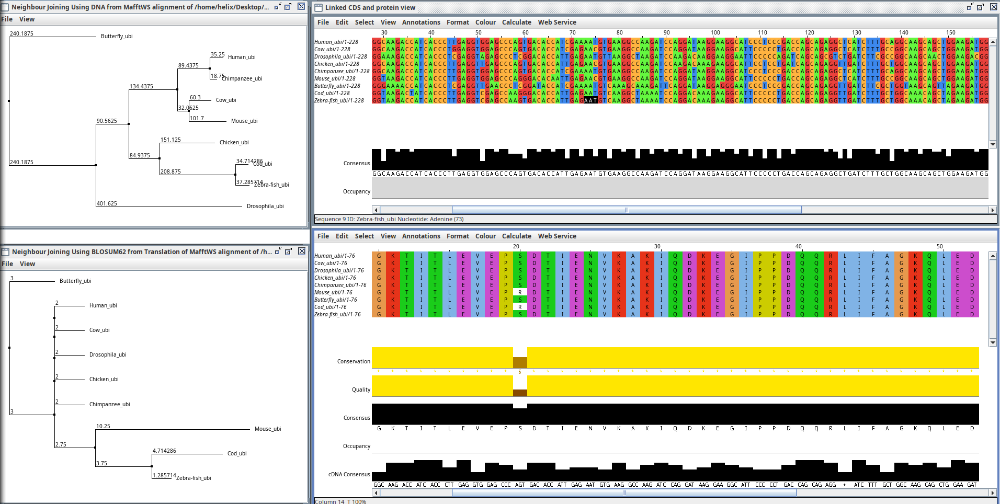

# Comparison of phylogenetic trees based on amino acid and nucleotide sequences of ubiquitin gene
  1. Open Jalview program and load the ubiquitin nucleotide sequences from `~/Desktop/Bioinformatics/data/phylogenetic/ubiquitin.fna`
  2. Create a multiple sequence alignment (MSA) using the ubiquitin nucleotide sequences. You can use mafft program from Jalview interface.
  3. Convert DNA alignment to amino acid alignment using the translation tool in Jalview. Use menu `Calculate > Translate as cDNA`
  4. Calculate Neighbor-Joining (NJ) tree for amino acid and nucleotide sequences. Use menu `Calculate > Calculate Tree of PCA...`
  5. Compare the topology of the trees. What do you observe? Are trees fully resolved?
  6. Export nucleotide and protein trees in Newick format. and visualize them using Dendroscope program
  7. Try different tree visualization options in Dendroscope. Test phylogram, cladogram and radial phylogram. Which tree visualization is the most informative? Which visualization better shows polytomies?

     

Solution

## Interpreting the Ubiquitin Trees

### 1. Resolution vs. Polytomy

**Nucleotide (DNA) tree:**  
Fully resolved, clean bifurcations, and a topology that matches expected taxonomy. Mammals group together, fish group together, insects form their own branch. Branch lengths vary, meaning the DNA accumulated enough substitutions to estimate distances.

**Protein (amino acid) tree:**  
Large polytomy. Several species (Human, Cow, Chicken, Fly, Chimp) emerge from the same node. Branch lengths are ~0. The data provide no usable signal for resolving relationships.

### 2. Why this happens: Ubiquitin’s extreme conservation

Checking the MSA makes the reason obvious.

**Protein sequence:**  
Conservation is almost maximal. Ubiquitin is functionally critical; most amino acid changes are lethal. Natural selection removes non-synonymous mutations. Result: nearly identical proteins across distant taxa. The algorithm sees zero distance, so the tree collapses into a polytomy.

**DNA sequence:**  
Despite a fixed protein sequence, the underlying DNA still changes. Codon degeneracy allows synonymous substitutions, especially at the 3rd codon position. These changes don’t alter the protein, so they accumulate.  
These silent mutations provide enough variation for the DNA-based tree to recover expected relationships (e.g., Human closer to Chimp than to Fish).

### 3. What to notice in Dendroscope

**Phylogram:**  
Branch lengths reflect actual distance. For ubiquitin proteins, this means almost no length—an honest representation of the lack of signal.

**Cladogram:**  
Ignores distances and only shows branching order. It may impose structure where none exists. The forced shape of tree doesn’t imply real resolution!

**Radial phylogram:**  
For protein data, expect a star-like pattern—just another way of displaying a polytomy.

### Summary

**When to use DNA:**  
For closely related species or highly conserved genes. Silent mutations provide the needed signal.

**When to use protein:**  
For deep evolutionary comparisons or less conserved genes, where DNA saturation and noise make nucleotides unreliable.

**For ubiquitin specifically:**  
The protein sequence is essentially unchanged for hundreds of millions of years. It provides *no* usable phylogenetic signal. Only the DNA—via synonymous mutations—contains enough variation to recover the evolutionary relationships.

