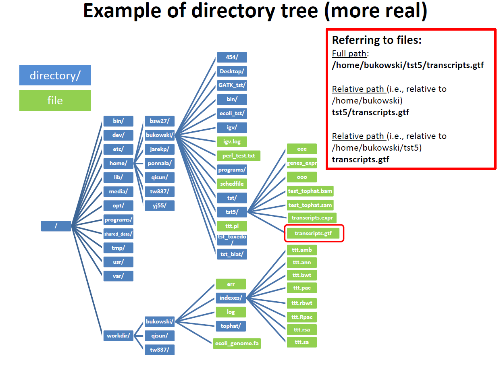

# Introducing the Shell

based on Software Carpentry course material

[https://software-carpentry.org](https://software-carpentry.org)

---
# Terminology:
-  differences between a **file** and a **directory**
- **Absolute** path vs. **relative** path
- Actual command, flags, and filenames in a command-line call."
- Demonstrate the use of **tab completion**, advantages

---
# What is shell:
- A shell is a program whose primary purpose is to read commands and run other programs
- Automating repetitive tasks, access networked machines."
- The shell's main disadvantages - primarily textual nature, cryptic its commands and operation

---
# Computer interfaces

**command-line interface**, or CLI,
 vs. 
**graphical user interface**, or GUI,
(prevalent)

The heart of a CLI is a **read-evaluate-print loop**, or REPL:
- read command
- evaluate command 
- print/output results

---

# Files and directories
- How can I move around on my computer? (`cd`)
- How can I see what files and directories I have? (`ls`')
- How can I specify the location of a file or directory on my computer?
- Translate an absolute path into a relative path and vice versa
- Construct absolute and relative paths that identify specific files and directories
- Identify the actual command, flags, and filenames in a command-line call
- Demonstrate the use of tab completion, and explain its advantages

---

## Files and directories
- The file system is responsible for managing information on the disk
- Information is stored in files, which are stored in directories (folders)
- Directories can also store other directories, which forms a directory tree

---

## Some commands
- "`cd path` changes the current working directory."
- "`ls path` prints a listing of a specific file or directory; `ls` on its own lists the current working directory."
- "`pwd` prints the user's current working directory."
- "`whoami` shows the user's current identity."
- "`/` on its own is the root directory of the whole file system."

---
# Relative vs Absolute path
- A relative path specifies a location starting from the current location.
- An absolute path specifies a location from the root of the file system.
- Directory names in a path are separated with '/'
- '..' means 'the directory above the current one'
- '.' on its own means 'the current directory'."
- Most files names are `something.extension`. The extension isn't required - just convention

---

---

# File system
The part of the operating system responsible for managing files and directories is called the **file system**. It organizes our data into files, which hold information, and directories (also called "folders"),
which hold files or other directories.

Several commands are frequently used to **create**, **inspect**, **rename**, and **delete** files and directories.

---

## Start shell
run `term` program

### command prompt:
~~~
manager@$bl8vbox: /home/manager$
~~~
a **prompt**, which shows us that the shell is waiting for input;
your shell may use a different character as a prompt and may add information before the prompt.
When typing commands, either from these lessons or from other sources, do not type the prompt, only the commands that follow it.

---

Type the command `whoami`,
then press the Enter key (sometimes marked Return) to send the command to the shell.
The command's output is the ID of the current user,
i.e.,
it shows us who the shell thinks we are:

~~~
$ whoami
~~~
output:

~~~
manager
~~~

---

More specifically, when we type `whoami` the shell:

1.  finds a program called `whoami`,
2.  runs that program,
3.  displays that program's output, then
4.  displays a new prompt to tell us that it's ready for more commands.

---

Next, let's find out where we are by running a command called `pwd` (which stands for "print working directory").
**current working directory** = default directory (the directory that the computer assumes we want to run commands in unless we explicitly specify something else)

---

## what "home directory" is?
~~~
.
├── bin
├── boot
├── dev
├── etc
├── home
|   ├── franta
|   ├── pavel
|   └── petr
├── lib
├── lib32
├── lib64
├── mnt
├── opt
├── proc
├── root
├── sbin
├── srv
...

~~~

---

**root directory**
- holds everything else - slash character `/`
(this is the leading slash in `/home/franta`)

We know that our current working directory `/home/franta` is stored inside `/home`
because `/home` is the first part of its name. 
Similarly, we know that `/home` is stored inside the root directory `/`because its name begins with `/`.

---

## Slashes
Two meanings for the `/` character.
At the front of a file or directory name = root directory
*inside* a name = it's just a separator.

---

# Basic commands
~~~
$ ls
~~~
example output:

~~~
Applications Documents    Library      Music        Public
Desktop      Downloads    Movies       Pictures
~~~

your results may be slightly different...

`ls` prints the names of the files and directories in the current directory in
alphabetical order, arranged neatly into columns.

---

`ls` has lots of other options. To find out what they are, we can type:

~~~
$ ls --help
~~~

~~~
Usage: ls [OPTION]... [FILE]...
List information about the FILEs (the current directory by default).
Sort entries alphabetically if none of -cftuvSUX nor --sort is specified.

Mandatory arguments to long options are mandatory for short options too.
  -a, --all                  do not ignore entries starting with .
  -A, --almost-all           do not list implied . and ..
      --author               with -l, print the author of each file
  -b, --escape               print C-style escapes for nongraphic characters
      --block-size=SIZE      scale sizes by SIZE before printing them; e.g.,
  ...
~~~

---

**most important `ls` options**:
~~~
  -a, --all                  do not ignore entries starting with .
  -F, --classify             append indicator (one of */=>@|) to entries
      --file-type            likewise, except do not append '*'
      --format=WORD          across -x, commas -m, horizontal -x, long -l,
                               single-column -1, verbose -l, vertical -C
      --full-time            like -l --time-style=full-iso
  -l                         use a long listing format
  -L, --dereference          when showing file information for a symbolic
                               link, show information for the file the link
  -r, --reverse              reverse order while sorting
  -R, --recursive            list subdirectories recursively
  -s, --size                 print the allocated size of each file, in blocks
  -S                         sort by file size, largest first
      --sort=WORD            sort by WORD instead of name: none (-U), size (-S),
                               time (-t), version (-v), extension (-X)
      --time=WORD            with -l, show time as WORD instead of default
      ....
~~~

---

Many bash commands, and programs that people have written that can be run from within bash, support a `--help` flag to display more information on how to use the commands or programs.

For more information on how to use `ls` we can type `man ls`. `man` is the Unix "manual" command: it prints a description of a command and its options, and (if you're lucky) provides a few examples of how to use it.

---

To navigate through the `man` pages
- use the up and down arrow keys to move line-by-line, or try the "b" and spacebar keys to skip up and down by full page.
- **Quit** the `man` pages by typing **q**.

---

## Parameters vs. Arguments
the terms **argument** and **parameter** - often used interchangeably

We can also use `ls` to see the contents of a different directory.
Let's take a look at our `Desktop` directory by running `ls -F Desktop`,

the command `ls` with the **arguments** `-F` and `Desktop`.
The second argument the one *without* a leading dash tells `ls` that
we want a listing of something other than our current working directory

---

try from home directory
~~~
ls Desktop/Sample_Data/ -l
~~~

- Files are organized in an hierarchical file system.
- Organizing things hierarchically in this way helps us keep track of our work:

---

We can actually **change our location** to a different directory, so we are no longer located in our home directory.

The command to change locations is `cd` followed by a directory name to change our working directory. `cd` stands for "change directory".

(bit misleading - the command doesn't change the directory, it changes the shell's idea of what directory we are in)

---

Try (from your home directory):

~~~
$ cd Desktop
$ cd Sample_Data
$ cd fasta
~~~

- `cd` doesn't print anything, but if we run `pwd` after it, we can see that we are now in different directory.
- If we run `ls` without arguments now - what does it list?

---

We now know how to go down the directory tree, but
how do we go up?  We might try the following:

~~~
cd Desktop
~~~
~~~
-bash: cd: data-shell: No such file or directory
~~~
We get an error!  Why is this?

---

`cd` can only see sub-directories inside your current directory.  There are different ways to see directories above your current location.
try:

~~~
ls -a
~~~
There is a shortcut in the shell to move up one directory level that looks like this:
~~~
$ cd ..
~~~

`..` is a special directory name meaning - ==**parent**== of the current directory.

---

- The special directory `..` doesn't usually show up when we run `ls`.  
- If we want to display it, we can give `ls` the `-a` flag:

~~~
$ ls -F -a
~~~

- `-a` stands for "show all"; it forces `ls` to show us file and directory names that begin with `.`,
such as `..` 
- it also displays another special directory that's just called `.` = "the current working directory".

Multiple parameters can be combined with a single `-` and no spaces between the parameters: `ls -F -a` is 
equivalent to `ls -Fa` 

---

## Other Hidden Files
- In addition to the hidden directories `..` and `.`, you may also see a more files begining with `.`
- Usually files and directories that are used to configure different programs on your computer.

---

## Summary
basic commands for navigating the filesystem on your computer:
`pwd`, `ls` and `cd`.  

What happens if you type `cd` on its own, without giving a directory?  

~~~
$ cd
~~~

`cd` without an argument -> return you to your home directory

---
## relative / absolute path
- to move up one level from the data directory - use `cd ..`
- there is another way to move to any directory, regardless of your
current location.  

- **relative paths** - find that location from where we are.
- **absolute path** - entire path from the root directory - indicated by a
leading slash -`/` 
---

## relative / absolute path
~~~
/
├── bin
├── boot
│   └── grub
├── cdrom
├── dev
│   ├── block
│   ├── bsg
│   ├── bus
│   ├── char
│       ├── dev
│       ├── font
...

~~~
absolute path - allows to specify file location from anywhere on the filesystem.

---

## Two More Shortcuts
-  the character `~` (tilde) at the start of a path to mean "the current user's home directory".

- `-` (dash) character.  `cd` translate `-` into *the previous directory I was in*

---

## Tab completion

let’s say you want to run the **firefox** command. You can just type **fir** or **fire** into the terminal and press Tab — if your system doesn’t have any other commands that begin with those letters, Bash will automatically fill in firefox and you can press Enter to run the command.

==This feature can dramatically help you speed up typing commands==

---

## Absolute vs Relative Paths

Starting from `/home/manager/Desktop/Sample_Data`, which of the following commands you could use to navigate to home directory, which is `/home/manager`?
~~~
1. cd .
2. cd /
3. cd /home/manager
4. cd ../..
5. cd ~
6. cd home
7. cd
8. cd ..
9. cd home/manager
~~~

---

**Relative Path Resolution**
If `pwd` displays `/Users/thing`, what will `ls ../backup` display?

`1. ../backup: No such file or directory`
`2. 2012-12-01 2013-01-08 2013-01-27`
`3. 2012-12-01/ 2013-01-08/ 2013-01-27/`
`4. original pnas_final pnas_sub`

---

## Exploring More `ls` Arguments
What does the command `ls` do when used with the `-l` and `-h` arguments?

- The `-l` arguments makes `ls` use a **l**ong listing format, showing not only the file/directory names but also additional information such as the file size  and the time of its last modification. 
- The `-h` argument makes the file size "**h**uman readable", i.e. display something like `5.3K` instead of `5369`

---

## Listing Recursively and By Time

- The command `ls -R` lists the contents of directories recursively, i.e., lists their sub-directories, sub-sub-directories, and so on in alphabetical order
- `ls -t` lists things by time of last change, with most recently changed files or directories first.
- In what order does `ls -R -t` display things?

---

# Creating file/directories

---

## create directory

~~~
ls
mkdir analysis
ls
~~~
`mkdir` means "make directory". Since `thesis` is a relative path (i.e., doesn't
have a leading slash), the new directory is created in the current working
directory:

---

## Good names for files and directories

1. Don't use whitespaces.
   You can use `-` or `_` instead of whitespace.
2. Don't begin the name with `-` (dash).
   Commands treat names starting with `-` as options.
3. Stick with letters, numbers, `.` (period), `-` (dash) and `_` (underscore).
   Many other characters have special meanings on the command line.

---

## Linux Text Editors
### Terminal based
- nano 
- vim
- emacs
### graphical 
- gedit

---

## nano

Control, Ctrl, or ^ Key

## gedit

try `gedit` 

---

## Removing files, directories

~~~
rm     # remove file(s)
rmdir  # remove dir - must be empty
~~~
try to `rm` directory  - what happens?

~~~
rm: cannot remove `thesis': Is a directory
~~~

try again with `rm -r`
=deleting files is forever!=

---

## Renaming and moving files `mv`
command `mv` means move
### exercise:
~~~
mkdir data
gedit samples.txt # create some text file and save
# quit gedit
ls
mv samples.txt data/ # moving
ls
ls data/
mv data/samples.txt data/list_of_samples.txt   # renaming
ls data/
~~~

---

# Pipes and Filters
 - How can I combine existing commands to do new things
 - Redirect a command's output to a file.
 - Process a file instead of keyboard input using redirection.
 -  Construct command pipelines with two or more stages 
 -  Unix's 'small pieces, loosely joined' philosophy."

---

## keypoints
- `cat` displays the contents of its inputs.
- `head` displays the first few lines of its input.
- `tail` displays the last few lines of its input.
- `sort` sorts its inputs.
- `wc` counts lines, words, and characters in its inputs.
- `*` matches zero or more characters in a filename, so `*.txt` matches all files ending in `.txt`.
- `?` matches any single character in a filename, so `?.txt` matches `a.txt` but not `any.txt`.
- `command > file` redirects a command's output to a file.
- `first | second` is a pipeline: the output of the first command is used as the input to the second.
- The best way to use the shell is to use pipes to combine simple single-purpose programs (filters).

---

## example
go to directory:
`~/Desktop/shell-novice/filesystem/Users/nelle/molecules`
 
~~~
$ ls molecules
~~~

~~~
cubane.pdb    ethane.pdb    methane.pdb
octane.pdb    pentane.pdb   propane.pdb
~~~

`wc` is the **word count** command:
it counts the number of lines, words, and characters in files.

~~~
cd molecules
ls *.pdb
wc *.pdb
wc -c *.pdb   # number of character only
wc -w *.pdb   # number of words
~~~

---

## Wildcards

`*` is a **wildcard**. It matches zero or more  characters, e.g:

- `*.pdb` matches `ethane.pdb`, `propane.pdb`
- `p*.pdb` only matches > `pentane.pdb` and `propane.pdb`

`?` is also a wildcard, but it only matches a single character
- `p?.pdb` would match `pi.pdb` or `p5.pdb`
    
When the shell sees a wildcard, it expands the wildcard to create a list of matching filenames *before* running the command that was asked for.

---

## Examples
try in directory
`~/Desktop/shell-novice/filesystem/Users/nelle/molecules`

~~~
ls *th*.pdb
ls ?????.pdb
~~~

---

# How to save output from program to file
- program arguments (e.g. -o filename)
- `>` redirection

~~~
ls 
wc -l *.pdb > lengths.txt
ls 
cat lengths.txt
~~~
- The greater than symbol, `>`, tells the shell to **redirect** the command's output to a file instead of printing it to the screen.
- If the file exists, it will be silently overwritten, which may lead to data loss and thus requires some caution.

---

# displaying files
- `cat` print whole file(s) on the screen
- `less` display page by page
- `head` and `tail` - beggining or end of file
---

# sorting

~~~
sort lengths.txt
# is this what we want?

sort -n lengths.txt
~~~

~~~
  9  methane.pdb
 12  ethane.pdb
 15  propane.pdb
 20  cubane.pdb
 21  pentane.pdb
 30  octane.pdb
107  total
~~~

---

We can put the sorted list of lines in another temporary file called `sorted-lengths.txt`
by putting `> sorted-lengths.txt` after the command

~~~
$ sort -n lengths.txt > sorted-lengths.txt
$ head -n 1 sorted-lengths.txt
~~~
Using the parameter `-n 1` with `head` tells it that we only want the first line of the file; `-n 20` would get the first 20, and so on.

---

# Pipes
~~~
$ sort -n lengths.txt | head -n 1
~~~

- The vertical bar, `|`, between the two commands is called a **pipe**.
-  It tells the shell that we want to use the output of the command on the left as the input to the command on the right. 
- we can chain multiple commands using pipes
~~~
$ wc -l *.pdb | sort -n
~~~

---

- linux -  lots of simple tools that each do one job well, and that work well with each other.
- this programming model is called "pipes and filters".

---

# redirecting using `>` or `>>`'
try:
~~~
echo "hello" 
echo "hello" > testfile01.txt
cat testfile01.txt
echo "hello" > testfile01.txt
cat testfile01.txt
echo "hello" >> testfile01.txt
cat testfile01.txt
~~~
what is the difference?
`>>` append to existing file
`>` overwrite existing file

---

# Loops

How can I perform the same actions on many different files?

in molecules directory

~~~
for FILENAME in cubane.pdb ethane.pdb methane.pdb
> do 
>    head -n 3 $FILENAME
> done
~~~
- `for` shell keyword
- `$FILENAME` variable
- command prompt is different `>`

---

# Iterating over all files in directory

~~~
for FILENAME in *.pdb
do 
    echo $FILENAME
    head -n 3 $FILENAME
done
~~~

---
# Using scripts

How we can reuse commands?

Create file:
~~~
gedit sample_script.sh
~~~
insert to file and save:

~~~
for FILENAME in *.pdb
do 
    echo $FILENAME
    head -n 3 $FILENAME
done
~~~
to run :
~~~
bash sample_script.sh
~~~

---

# scripts arguments

create script `test_script.sh`:
~~~
echo $1
echo $2
echo $3
~~~
try:
~~~
bash test_script.sh A B C
~~~
iterate over all arguments `$@`:

~~~
for i in $@
do
  echo $i
done
~~~

---

# Finding Things
- How can I find files
- How can I finth things in files?
- `grep` finds and prints lines in files that match a pattern.
- `find` finds files with specific properties that match patterns.

---

# `grep`

Global/Regular Rexpression/Print
~~~
cd /home/manager/Desktop/shell-novice/filesystem/Users/nelle/writing
cat haiku.txt
grep not haiku.txt
~~~

Here, `not` is the pattern we're searching for
Let's try a different pattern: `day`

~~~
grep day haiku.txt
# count occurences
grep -c day haiku.txt

~~~

---

Analyzing fasta files:
~~~
# count number of sequences in fasta:
grep -c ">" ~/Desktop/Sample_Data/muscle/peps_to_align.fasta
# list sequence ids:
grep ">" ~/Desktop/Sample_Data/muscle/peps_to_align.fasta
grep ">OLATSOX9B" -A 10 ~/Desktop/Sample_Data/muscle/peps_to_align.fasta
grep -c ">" ~/Desktop/Sample_Data/**/*.fasta
~~~
---

# `grep` other useful options
~~~
grep -w "is not" haiku.txt   # whole words
grep -n "is not" haiku.txt   # show line numbers
grep -n -w -i "the" haiku.txt  # -i = case insensitive
grep -v -i "The" haiku.txt   # -v invert match
# see help for more

~~~

---

# `find` command

~~~
find .
~~~

- the `.` on its own means the current working director
- `find`'s output is the names of every file and directory under the current working directory.

~~~
find . -type d   # directories
find . -type f   # files
~~~

---

## wildcard matching:

~~~
find . -name *.txt    # shell expands * before running find!

find . -name '*.txt'
~~~

## combining find and other command
use `$()` expression
~~~
cd /home/manager/Desktop/shell-novice/filesystem/Users/nelle
wc $(find ./data -name '*.txt')
# is equivalent to :
wc ./data/one.txt ./data/two.txt ./haiku.txt
~~~

---

## combining grep and find 

 - first find files which match pattern
 - second - look for another pattern inside those files
 try in `Users/nelle` directory
 
~~~
grep FE  $(find .. -name '*.pdb')
~~~

---
running command line blast:
visit `ftp://ftp.ncbi.nih.gov/refseq/M_musculus/mRNA_Prot`
Download sequences and create blast database

~~~ 
cd ~/Desktop
mkdir blast_test
cd blast_test
# download sequences
wget ftp://ftp.ncbi.nih.gov/refseq/M_musculus/mRNA_Prot/mouse.{1..3}.protein.faa.gz 
#unzip
gunzip mouse.?.protein.faa.gz
#concatenate files
cat  mouse.?.protein.faa > mouse.protein_all.fasta
# create blast database
makeblastdb -in mouse.protein_all.fasta -dbtype prot 
ls -l
~~~

---

Downlad more sequences
~~~
wget ftp://ftp.ncbi.nih.gov/refseq/D_rerio/mRNA_Prot/zebrafish.1.protein.faa.gz
gunzip zebrafish.1.protein.faa.gz
head zebrafish.1.protein.faa -n 8 > first_two.fasta
# run blast search:
blastp -db mouse.protein_all.fasta -query first_two.fasta
# to see more options use:
blastp -help

# -outfmt
# 1 = query-anchored showing identities,
# 2 = query-anchored no identities,
# 3 = flat query-anchored, show identities,
# 4 = flat query-anchored, no identities,
# 6 = tabular,
# 7 = tabular with comment lines,

~~~
how to redirect output to file?
try this option:
`-html`

